# Google APIs

구글은 그 명성에 맞게 다양한 데이터를 API를 통해 제공합니다. 구글 캘린더, 유튜브 등 일반인이 많이 사용하는 서비스 뿐만 아니라 Google Cloud에서 제공하는 AI서비스에 대한 API도 있습니다. 음성을 텍스트로 변경해주는 Cloud Speech-to-Text API, 구글 번역을 위한 Cloud Translation API도 API를 통해 접근할 수 있습니다.

몇 가지 서비스에 대한 API이름과 API문서의 링크

| 서비스 | API이름                                                      | URL: API문서의 링크                                          |
| ------ | ------------------------------------------------------------ | ------------------------------------------------------------ |
| 지메일 | [Gmail API](https://developers.google.com/gmail/api/v1/reference/) | https://developers.google.com/gmail/api/v1/reference/        |
| 캘린더 | [Calendar API](https://developers.google.com/calendar/v3/reference/) | https://developers.google.com/calendar/v3/reference/         |
| 유튜브 | [YouTube Data API v3](https://developers.google.com/youtube/v3/docs/) | https://developers.google.com/youtube/v3/docs/               |
| 번역   | Cloud Translation API                                        | https://cloud.google.com/translate/docs/reference/rest       |
| STT    | Cloud Speech-to-Text API                                     | https://cloud.google.com/speech-to-text/docs/reference/rest/ |

## 사용 가능한 API 확인하기

* 구글 계정이 있을 경우 [구글 개발자 콘솔 (Google Deverlopers Console)](https://console.developers.google.com/)의 API Library에서 확인할 수 있습니다. 
* [Google APIs Explorer](https://developers.google.com/apis-explorer)에서는 API리스트가 정리되어 있어서 일목요연하게 볼 수 있습니다.
* 혹은 구글 [Product Index](https://developers.google.com/products/) 페이지에서 구글의 전체 상품과 API를 확인할 수 있습니다.

### [구글 개발자 콘솔 (Google Deverlopers Console)](https://console.developers.google.com/)

구글 개발자 콘솔에 접속하기 위해서는 구글 계정 로그인하고  웹브라우저에 https://console.developers.google.com/를 입력하면 됩니다.

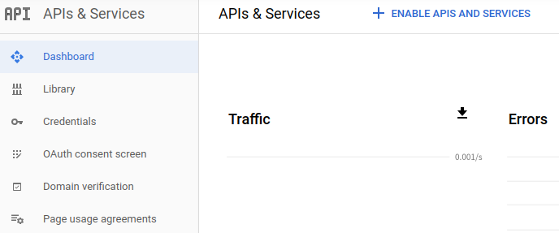

#### API Library

메뉴에서 "APIs & Services > Library"를 선택하면 API Library에 접속할 수 있습니다. API Library에는 사용가능한 전체 API의 리스트가 있습니다.

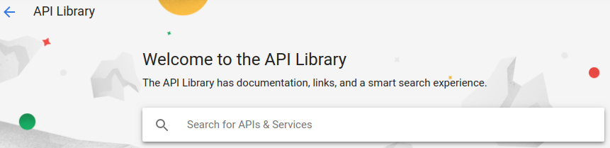

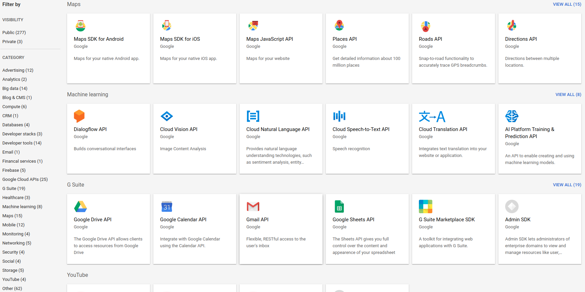

API Library에 있는 상품의 API 몇 개를 발췌해봤습니다.

| Category | Product       | API Name            | Description                                                  |
| -------- | ------------- | ------------------- | ------------------------------------------------------------ |
| Maps     | 구글 맵       | Distance Matrix API | Travel time and distance for multiple destinations.          |
| Maps     | 구글 지도     | Places API          | Get detailed information about 100 million places            |
| Maps     | 구글 지도     | Time Zone API       | Time zone data for anywhere in the world.                    |
| G Suite  | 구글 캘린더   | CalDAV API          | The CalDAV API lets you manage your Google calendars and events. |
| G Suite  | 구글 캘린더   | Google Calendar API | Integrate with Google Calendar using the Calendar API.       |
| G Suite  | 지메일        | Gmail API           | Flexible, RESTful access to the user's inbox                 |
| G Suite  | 구글 드라이브 | Google Drive API    | The Google Drive API allows clients to access resources from Google Drive |
| G Suite  | 구글 Docs     | Google Docs API     | Reads and writes Google Docs documents.                      |
| G Suite  | 구글 Sheets   | Google Sheets API   | The Sheets API gives you full control over the content and appearence of your spreadsheet data. |
| G Suite  | 구글 Slides   | Google Slides API   | Reads and writes Google Slides presentations.                |
| Youtube  | 유튜브        | YouTube Data API v3 | The YouTube Data API v3 is an API that provides access to YouTube data, such as videos, playlists,… |
| Other    | 구글 북스     | Books API           | The Google Books API allows clients to access the Google Books repository. |
| Other    | 구글 검색     | Custom Search API   | Retrieve and display search results from Google Custom Search programmatically. |

### Google APIs Explorer

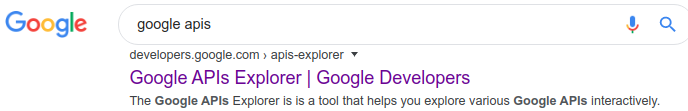

[Google APIs Explorer](https://developers.google.com/apis-explorer) (https://developers.google.com/apis-explorer)는 API가 제공되는 상품의 API문서 리스트가 정리되어 있습니다. 2020년 2월 25일 기준으로 총 177개의 API가 있습니다. 검색창으로 입력된 키워드에 대한 API를 찾을 수 있는데요.

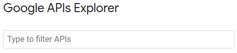

"youtube"를 입력해보면 YouTube과 연관된 API들만 필터링해서 보여줍니다.

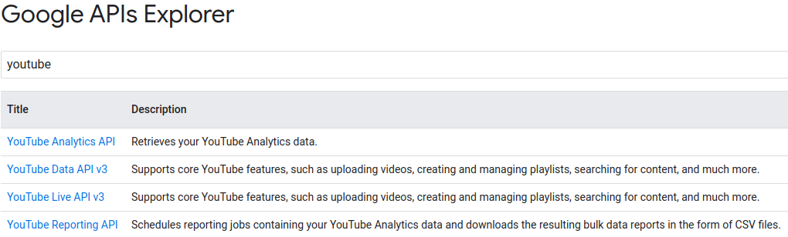

이 중 Youtube Data API를 클릭하면 API 문서 (API Reference)가 열립니다.

### 구글 [Product Index](https://developers.google.com/products/) 페이지

API를 찾는 또 다른 경로는 구글의 상품 (Product) 페이지를 통하는 것입니다. 인기 상품 뿐만 아니라 전체 상품을 보여주기 때문에 큰그림을 보기에 좋습니다. 전체 상품 중 일부만 API가 제공됩니다.

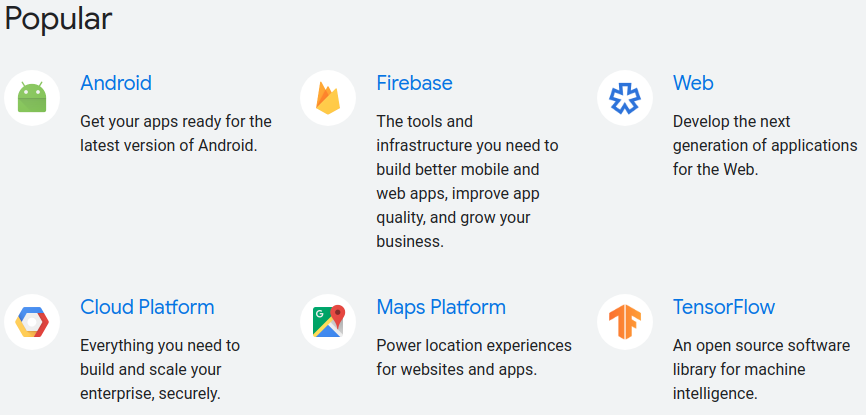

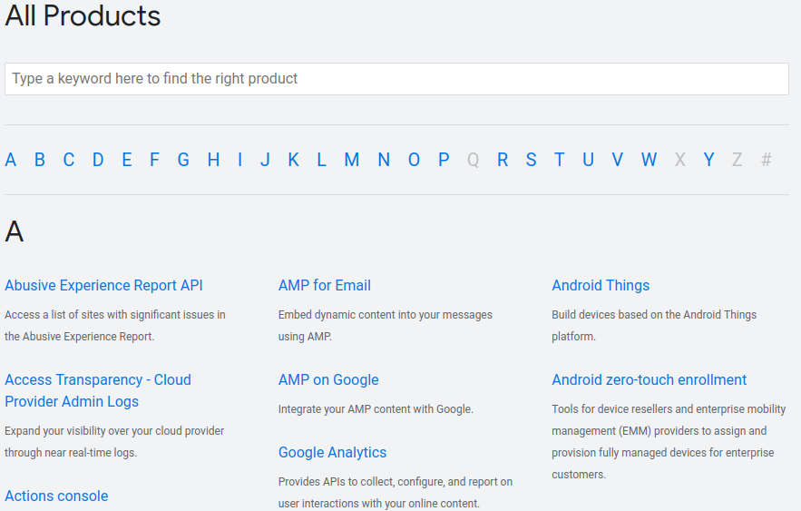

## API 문서 (API Reference)

API에는 일반적인 규칙이 있지만 어떤 API는 이런 규칙에서 약간 벗어날 수 있습니다. 그러므로 API에 관해 경험이 많더라도 목표로 하는 API의 문서를 읽는 것이 중요합니다. 

### API문서: YouTube Data API

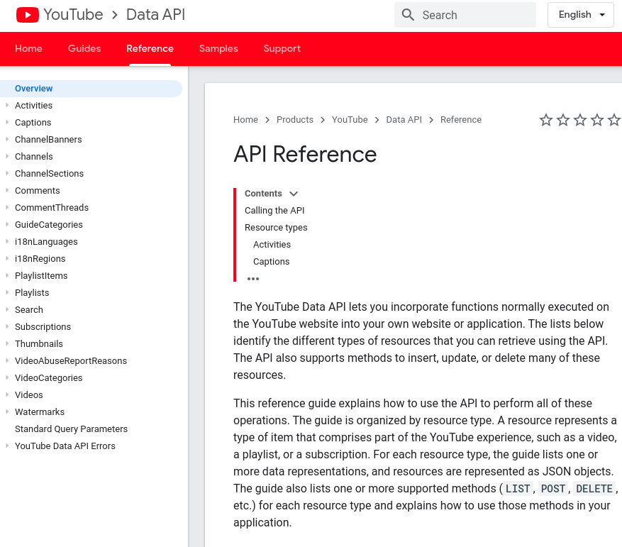

YouTube처럼 한국에서도 자주 쓰는 서비스는 (우측 상단의) 언어를 한국어로 변경할 수도 있습니다.

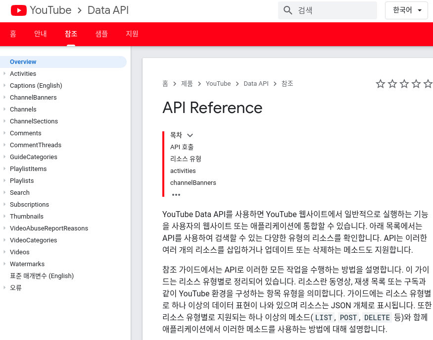

### API문서: Calendar API

다른 예로 Calendar API의 API문서가 있습니다. 현재는 영어만 지원합니다.

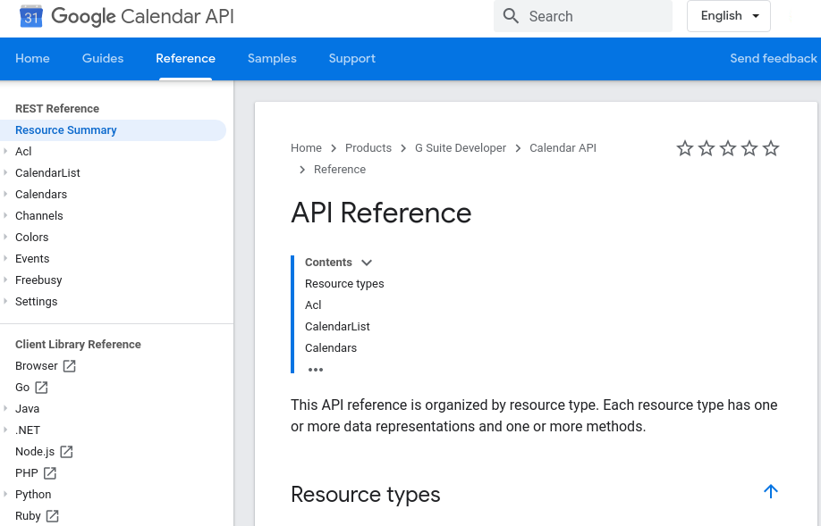

## 시작하기 (Getting Started)

1. 구글 계정을 생성해서 로그인을 합니다.

2. 구글 API접속을 위한 Credentials를 [Google API Console](https://console.developers.google.com/cloud-resource-manager)에서 생성합니다.

   * [Google API Console](https://console.developers.google.com/cloud-resource-manager) (https://console.developers.google.com/cloud-resource-manager)에서 "메뉴 > APIs & Services > Credentials"을 선택합니다.

   

   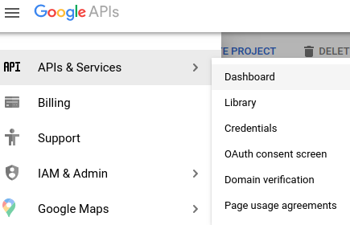

오픈된 Credentials 메뉴는 아래와 같습니다.

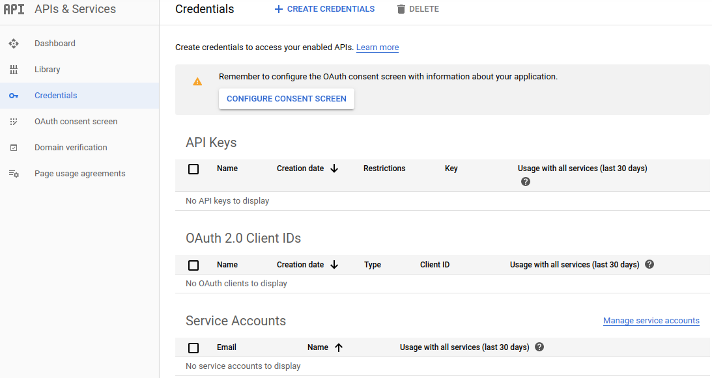

* 신규 API key를 생성합니다. 참고로 이미 생성한 key가 있는 경우에는 재사용을 고려할 수 있습니다.

  * "CREATE CREDENTIALS > API Key"을 선택한 후, 

  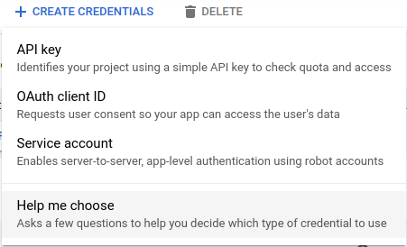
  
  * 팝업창에서 "RESTRICT KEY"를 클릭합니다. 

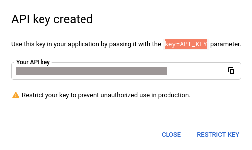

 * 원하는 제한사항을 선택한 후 "Save"버튼을 눌러서 저장합니다.

   

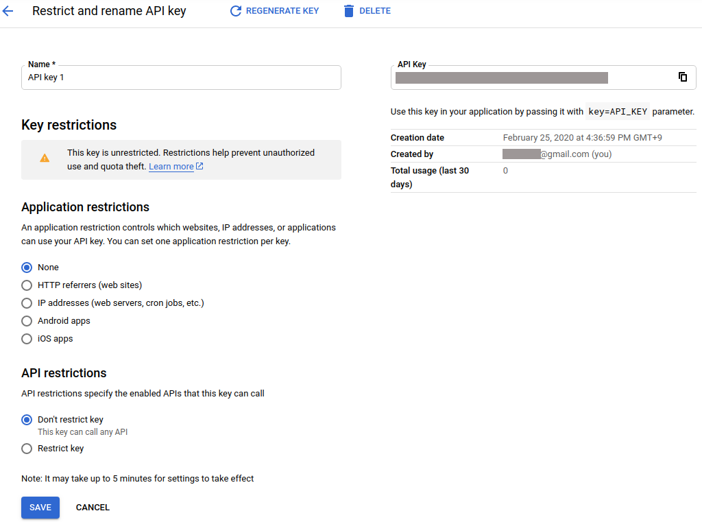

* Application restrctions

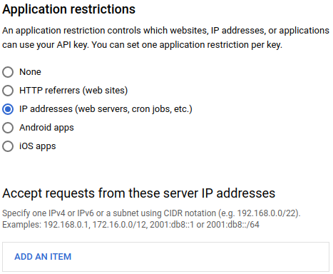

* API restrictions

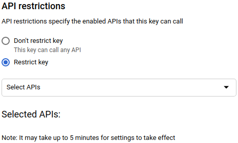

[Python Quickstart](https://developers.google.com/youtube/v3/quickstart/python)

Google search: api that shows android apps ranking

Google Play의 앱 링킹을 알려주는 API로 시작일~종료일 등의 정보를 넣으면 구간 동안의 App 랭킹을 보여주는 API인 듯 합니다. 테스트는 안 해봤습니다.

* Google Play App Rank History API https://42matters.com/docs/app-market-data/android/apps/ranks

* [Is there an API for the Google Play Store?](https://www.quora.com/Is-there-an-API-for-the-Google-Play-Store)