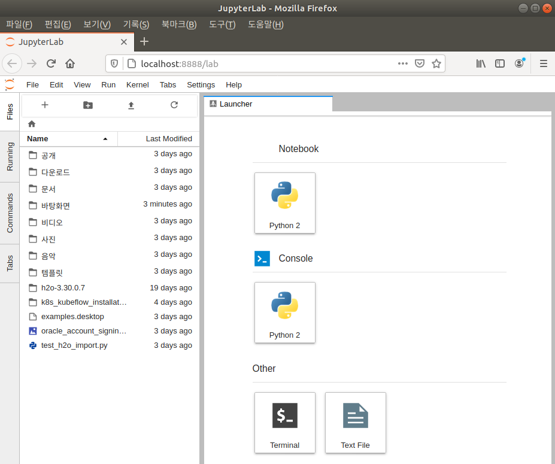

* Draft: 2020-08-10 (Mon)

# Jupyter Lab 설치하기
이 내용은 [Installation](https://jupyterlab.readthedocs.io/en/stable/getting_started/installation.html) 문서에 있는 내용을 참고로 설명을 덧붙인 것입니다.

가장 간단한 설치 방법은 `pip`을 이용해서 현재 계정에 직접 설치하는 것입니다. 실전에서는 Conda 가상 환경이나 Docker 컨테이너 환경에 설치합니다.

## Linux 머신에 직접 설치하기

```bash
$ pip install jupyterlab
```

### 실행 화면
```bash
$ pip install jupyterlab
Collecting jupyterlab
  Downloading https://files.pythonhosted.org/packages/1b/1b/ce43d66010878f86e574ae94d4aa6f78028ba5dba7287e11ebbaea2b3c17/jupyterlab-0.33.12-py2.py3-none-any.whl (14.3MB)
    100% |████████████████████████████████| 14.3MB 125kB/s 
  ...
Successfully installed MarkupSafe-1.1.1 ... zipp-1.2.0
```

### JupyterLab 시작하기
컴퓨터 재부팅 후 터미널에서 `jupyter lab`을 실행합니다. jupyter와 lab 사이에는 스페이스가 있습니다. 재부팅을 하지 않으면 명령어를 찾을 수 없어서 실행이 되지 않습니다.

```bash
$ jupyter lab
[I 09:58:49.998 LabApp] Writing notebook server cookie secret to /home/h2o/.local/share/jupyter/runtime/notebook_cookie_secret
[W 09:58:50.125 LabApp] JupyterLab server extension not enabled, manually loading...
[I 09:58:50.126 LabApp] JupyterLab extension loaded from /home/h2o/.local/lib/python2.7/site-packages/jupyterlab
[I 09:58:50.126 LabApp] JupyterLab application directory is /home/h2o/.local/share/jupyter/lab
[I 09:58:50.129 LabApp] Serving notebooks from local directory: /home/h2o
[I 09:58:50.129 LabApp] The Jupyter Notebook is running at:
[I 09:58:50.129 LabApp] http://localhost:8888/?token=8edd44883a5404aa72ec2ceaf7c34d5732c4a178b9cfabf5
[I 09:58:50.129 LabApp] Use Control-C to stop this server and shut down all kernels (twice to skip confirmation).
[C 09:58:50.132 LabApp] 
    
    To access the notebook, open this file in a browser:
        file:///home/h2o/.local/share/jupyter/runtime/nbserver-2599-open.html
    Or copy and paste one of these URLs:
        http://localhost:8888/?token=8edd44883a5404aa72ec2ceaf7c34d5732c4a178b9cfabf5
[W 09:58:52.600 LabApp] Could not determine jupyterlab build status without nodejs
```

웹브라우저가 자동 실행되면서 JupyterLab을 실행할 수 있는 환경이 설정됩니다. 



### JpyterLab의 사용
* 터미널에서는 JupyterLab을 시작하고 끝내는 것이 다 이고,
* 나머지 모든 작동은 웹브라우저에서 이루어집니다.

## Conda 가상 환경에 설치하기

```bash
$ conda install -c conda-forge jupyterlab
```
[TODO: 확인해볼 것]

## Docker 컨테이너 환경에 설치하기

```bash
$ jupyter serverextension enable --py jupyterlab --sys-prefix
```
[TODO: 확인해볼 것]
