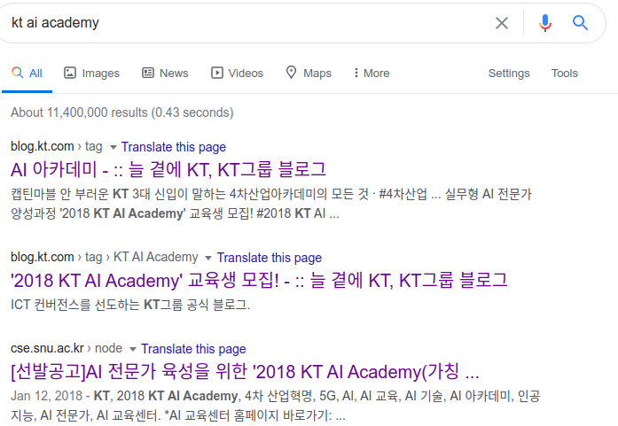
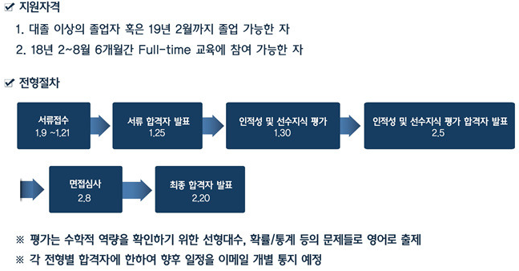
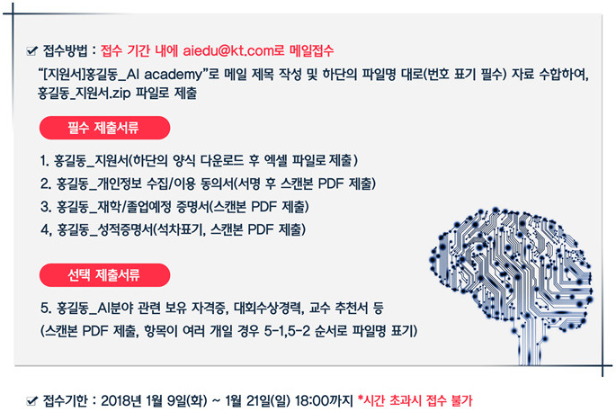
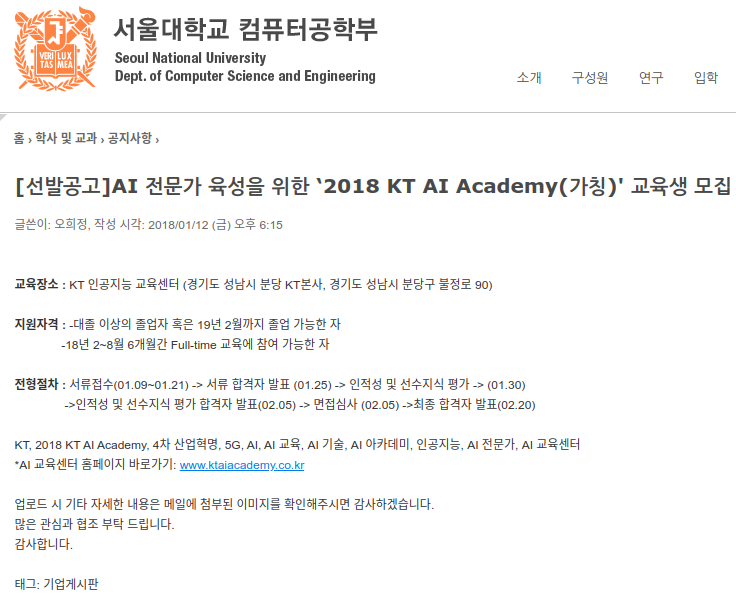
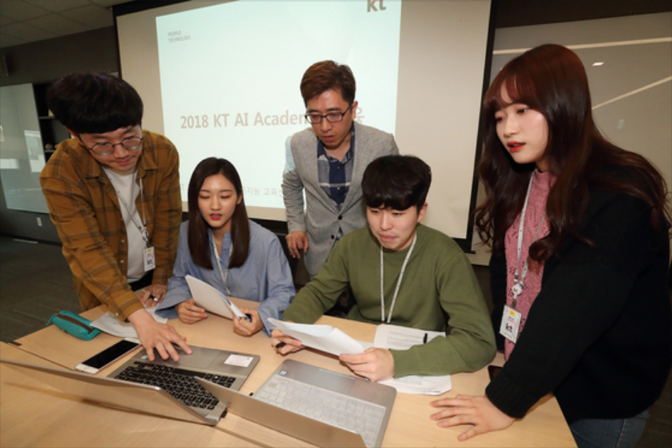

* Draft: 2020-07-06 (Mon)

# KT AI Academy 소개

## Google search: kt ai academy

## 프로그램 개요

* 기업에 필요한 실무형 AI 인재 배출을 위한 교육 프로그램
* 실행 기관: KT AI 교육센터

* **6개월 전일제**로 빠짐 없이 교육 참여가 가능해야 함
  * 교육 기간: 2018년 2월 26일~8월 3일
  * 관련 비용은 전액 무상으로 제공

출처: [실무형 AI 전문가 양성과정 '2018 KT AI Academy` 교육생 모집! ](https://blog.kt.com/992), https://blog.kt.com/992

## 선발 공고 예

Source: https://cse.snu.ac.kr/node/30143

[학교서 못 키우는 AI 인재, IT 기업이 기른다](https://news.joins.com/article/22750334?cloc=crawling), 2018.06.27, 중앙일보

