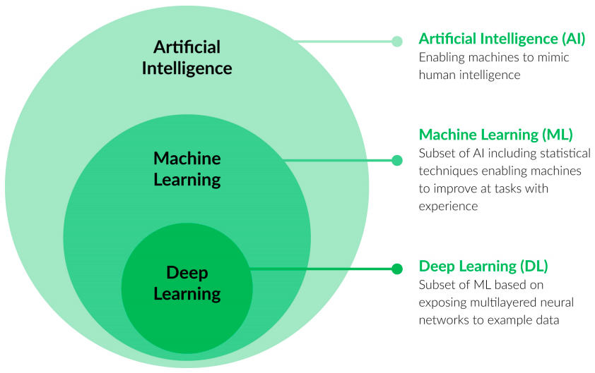
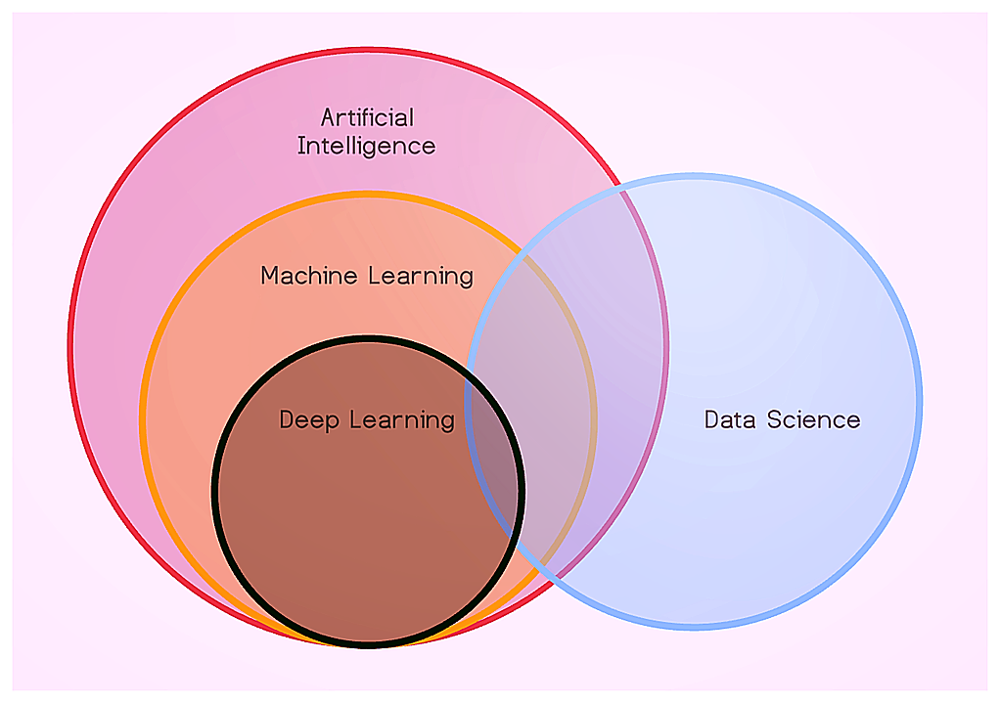
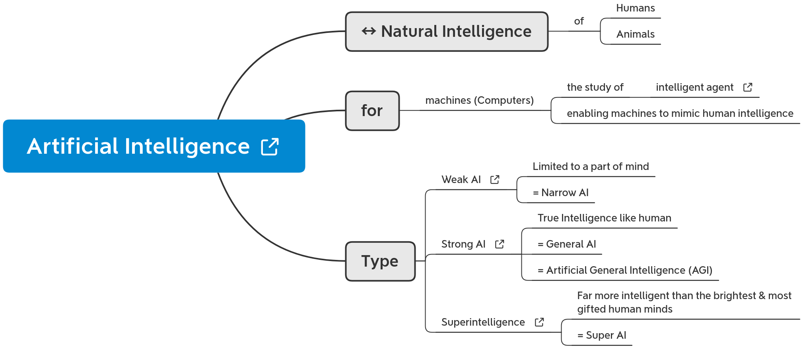
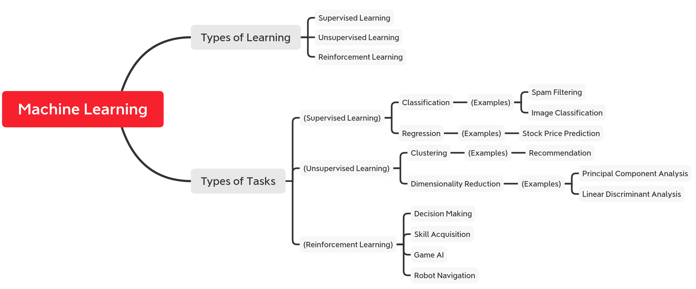
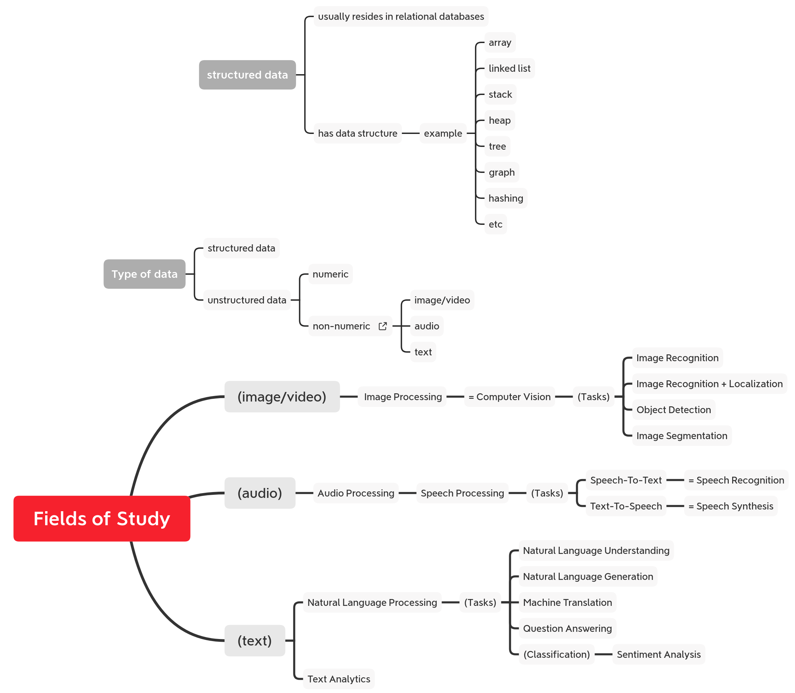
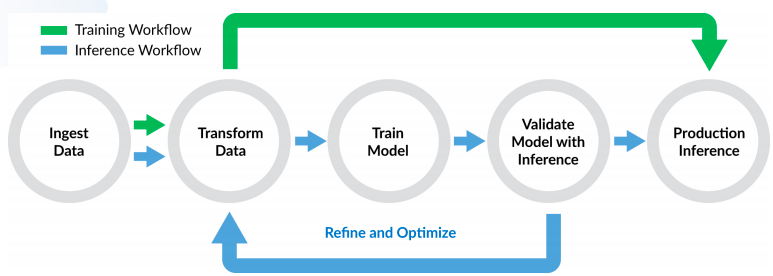
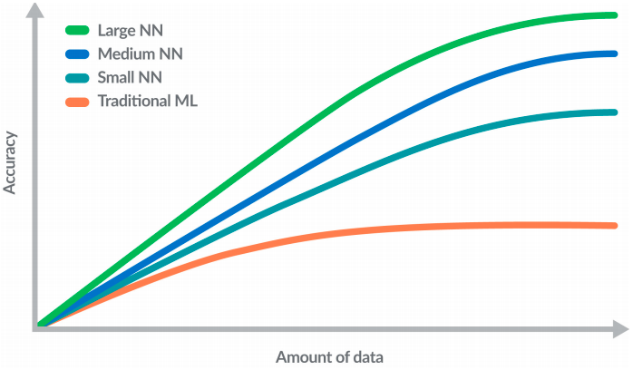

* Draft: 2020-07-06 (Mon)

# Overview-AI, ML & DL

## Artificial Intelligence, Machine Learning, Deep Learning

Source: [Scaling Deep Learning Performance on the NVIDIA DGX-1 Server with WekaIO Matrix](https://www.arista.com/assets/data/pdf/Whitepapers/NVIDIA-WP-Scaling-DL-with-Matrix-DGX-1-W03WP201904.pdf), White Paper, WEKA.IO, NVIDIA

Source: [What’s the Difference Between Artificial Intelligence, Machine Learning and Deep Learning?](https://blogs.nvidia.com/blog/2016/07/29/whats-difference-artificial-intelligence-machine-learning-deep-learning-ai/), 2016-07-29, Michael Copeland

## Data Science with respect to AI, ML & DL

[What are the general categories of artificial Intelligence (AI)? Where can I learn more about each?](https://www.quora.com/What-are-the-general-categories-of-artificial-Intelligence-AI-Where-can-I-learn-more-about-each), 2018-11-30, Quora

## A Venn diagram approximately representing machine intelligence (AI)Are ML, DL, DS the unique relations of AI?

Source: [Are ML, DL, DS the unique relations of AI?](https://medium.com/@4deep.prk/are-ml-dl-ds-the-unique-relations-of-ai-a52d7735c88), 2020-02-28, Medium

### Artificial Intelligence

### Simple reflex agent

Source: [Intelligent agent](https://en.wikipedia.org/wiki/Intelligent_agent)

## Machine Learning

### Fields of Study

### Data Pipeline of Machine/Deep Learning 

## Deep Learning

### Accuracy of Models Grows with the Amount of Training Data (Andrew Ng)

Source: [Scaling Deep Learning Performance on the NVIDIA DGX-1 Server with WekaIO Matrix](https://www.arista.com/assets/data/pdf/Whitepapers/NVIDIA-WP-Scaling-DL-with-Matrix-DGX-1-W03WP201904.pdf), White Paper, WEKA.IO, NVIDIA

### Convolutional Neural Networks

#### GoogLeNet, 2014,  Christian Szegedy et.al. 

* Paper: [Going deeper with convolutions](https://arxiv.org/abs/1409.4842), [PDF](https://arxiv.org/pdf/1409.4842.pdf)
* Code
  * [GoogLeNet ](https://pytorch.org/hub/pytorch_vision_googlenet/), PyTorch
  * https://github.com/pytorch/vision/blob/master/torchvision/models/googlenet.py

Source: [Going deeper with convolutions (2014)> GoogLeNet network with all the bells and whistles ](https://www.researchgate.net/figure/GoogLeNet-network-with-all-the-bells-and-whistles_fig1_305196650)

