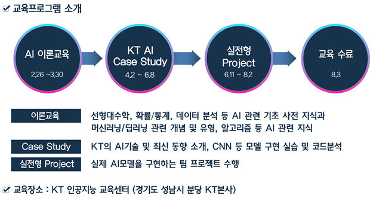

* Draft: 2020-07-06 (Mon)

# Q&A

## 인공지능(AI) 전문가로의 진로개발

https://www.pigeonhole.at/SOOKAI/q/946726

Q: 인공지능에 관심이 있는데 학부생으로써 따로 어떻게 공부를 하고 어떠한 활동을 하면 좋을지 궁금합니다.
Q: 인공지능을 하기 위해선 수학을 잘해야한다고 하는데 수학의 어느 정도로 공부를 해야하는지 궁금하고 어떤식으로 공부를 하셨는지 궁금합니다.

[KT AI Academy 소개](qna.md)

[학교서 못 키우는 AI 인재, IT 기업이 기른다](https://news.joins.com/article/22750334?cloc=crawling), 2018-06-27, 중앙일보

> 국내 대학생들은 인공지능 관련 실무 교육이 절실하다고 말한다. **KT AI 아카데미 수강생인 김성철(27·연세대)씨는 “영상처리를 공부하다 인공지능에 흥미가 생겼지만 유튜브 등을 뒤지며 인터넷 강의를 들어야만 했다”며 “혼자서 공부하면 한계에 부딪힐 때가 많았고 구글링하는 데도 한계가 많았다”**고 설명했다. 

> 김승연씨도 “국내 대학교에서는 인공지능 분야 수업을 찾기가 힘들뿐 아니라 관련 논문을 접할 기회도 별로 없다”고 지적했다.
>
> 정부가 인공지능 전문대학원을 개설하면 이런 현실에 다소 숨통이 트일 것으로 보인다. 4차산업혁명위원회는 지난달 “2022년까지 인공지능에 특화된 전문대학원 6곳을 신설하겠다”고 발표했다. 4차위는 “인공지능을 전문적으로 다루는 고급 인재 1400명, 관련 분야에서 일하는 융복합 인재 3600명이 양성될 것”이라고 내다봤다. 
>
> **글로벌 IT 기업의 인공지능 인재 육성**
>
> **마이크로소프트(MS)**
> ● 인공지능 단과대 설립해 연간 10만 명 인재 양성 예정
> ● 인공지능 강좌 250가지 온라인 제공, MS가 수료생 인증
> **바이두**
> ● 인공지능 인재 양성 목적의 윈즈(雲智) 아카데미 설립
> ● 중국 베이징대에 투자해 인공지능 학문 연구 지원
> **엔비디아**
> ● ‘딥러닝 인스티튜트’로 온·오프라인 인공지능 교육 진행
> ● 연세대와 손잡고 인공지능 전문가 양성 과정 신설

Q: 인공지능을 공부하려면 꼭 석사, 박사까지 공부해야하는 것인지 궁금합니다.
Q: 뇌과학과 관련해 개설된 수업을 듣는 것도 도움이 될 지 궁금합니다.

### 대학원 진학 이슈

Q: 인공지능 관련 대학원 진학을 위해 어떤걸 준비해야할까요?
Q: 인공지능을 공부하기 위해 국내보다 해외 대학원을 가는게 더 나은가요?

A: 인공지능은 하나의 분야입니다. 인공지능을 클래식 음악으로 바꿔서 콘서트 피아니스트에게 질문하면 어떤 답변을 예상할 수 있을까요? [+추가 답변]

Q: 현재 뉴스를 보면 가족 처럼 함께 이야기를 나누면서 사는 AI들이 점점 발전하는 모습들이 많이 나오고 있습니다. 전문가님이 생각하시기에는 이러한 가정용 AI가 산업용 AI보다 발전 속도가 빠를 것이라고 생각하시나요?

[14 categories of enterprise Artificial Intelligence (AI) and Machine Learning solutions ](https://issuu.com/tabraizfeham/docs/topbots_enterprise_ai_landscape_2018_2019_v2), 2019-09-19

