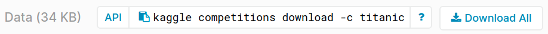
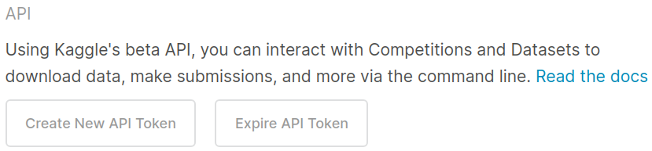
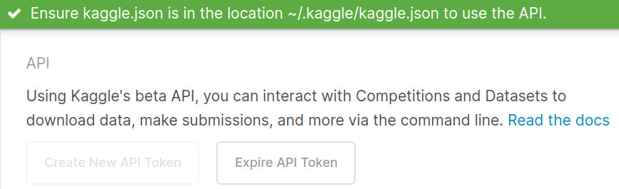
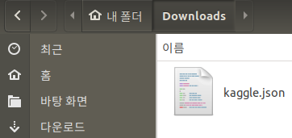

##### aimldl/VOX/kaggler/1_Novice_Competitions/kaggle_api.md

* Draft: 2020-03-31 (Tue)

# Kaggle API 설치 및 설정하기

첫 문제인 타이타닉 데이터셋은 https://www.kaggle.com/c/titanic/data에서 다운로드할 수 있다.



## 웹브라우저에서 내려받기

"Download All" 버튼을 누르면 titanic.zip을 내려받을 수 있다. 아래처럼 압축을 풀면 생성되는 3개의 파일 중 train.csv와 test.csv이 모델 훈련과 테스트에 쓸 데이터 파일이다.

```
~/Downloads$ unzip titanic.zip
~/Downloads$ ls
gender_submission.csv  test.csv  titanic.zip  train.csv
~/Downloads$
```

"~/github/VOX/kaggle/Compete/titanic_dataset/data"에 디렉토리를 생성해서 해당 파일을 옮긴다.

```
~/github/VOX/kaggle/Compete/titanic_dataset/data$ ls
gender_submission.csv  test.csv  train.csv
~/github/VOX/kaggle/Compete/titanic_dataset/data$ 
```

## hands-on 디렉토리로 볼륨 마운팅하기

"titanic_dataset" 디렉토리를 Docker Container의 "hands-on" 디렉토리에 볼륨 마운트를 해봅니다. 이렇게 특정 디렉토리를 Docker Container의 내부 디렉토리에 "매핑"을 하게 되면, 컨테이너에서 빠져나왔을 때 데이터가 날라가는 문제를 해결할 수 있습니다. 이와 더해 디렉토리 매핑을 구조화하므로써 코드를 github에 저장하는 등의 추가적인 장점도 있습니다. 처음에는 명령어가 복잡해 보이지만 한번 익혀놓으면 반복적으로 사용할 수 있으므로 아래의 명령어로 실행해봅니다.

Docker 컨테이너는 "캐글 베이스 이미지 (aimldl/baseimage_kaggle_python3.7.6_conda4.8.2_ubuntu18.04.4)"에서 실행시킵니다.

```
~/github/VOX/kaggle/Compete/titanic_dataset/data$ docker images
REPOSITORY                                                     TAG     ...  SIZE
aimldl/baseimage_kaggle_python3.7.6_conda4.8.2_ubuntu18.04.4  latest   ...  8.18GB
  ...
hello-world                                                   latest   ...  1.84kB
~/github/VOX/kaggle/Compete/titanic_dataset/data$ 
```

-v 옵션에서 ""-v A:B"라고 입력하면 컨테이너 외부의 A와 내부의 B를 매핑하게 됩니다. 즉, 

* ~/github/VOX/kaggle/Compete/titanic_dataset
* /home/user/hands-on

이 매핑되므로 하위 디렉토리는 동일해집니다.

```
$ docker run -it --name titanic -p 8080:8080 -v ~/github/VOX/kaggle/Compete/titanic_dataset:/home/user/hands-on aimldl/baseimage_kaggle_python3.7.6_conda4.8.2_ubuntu18.04.4 bash
2020-03-31 (Tue) 04:27 (13th week)
Welcome to ubuntu18.04, conda 4.8.3, Python 3.7.6
(base) user@69833fa22777:~$ 
```

""--name titanic" 옵션으로 컨테이너의 이름을 titanic이라고 붙였습니다. 아래는 titanic 컨테이너에서 실행되는 명령어입니다. "~/github/VOX/kaggle/Compete/titanic_dataset" 디렉토리와 동일한 디렉토리/파일 구조를 가지는 것을 알 수 있습니다. 

```
(base) user@69833fa22777:~$ ls
anaconda3  hands-on  project
(base) user@69833fa22777:~$ tree hands-on/
hands-on/
|-- data
|   |-- gender_submission.csv
|   |-- test.csv
|   `-- train.csv
`-- notebooks
(base) user@69833fa22777:$ 
```

## 매핑 (볼륨 마운트)된 컨테이너 안밖의 디렉토리의 동작 확인

컨테이너 안밖이 같이 동작하는 것은 간단하게 확인할 수 있습니다.

### 컨테이너 안에서 만든 파일이 밖에서 보임

컨테이너 안에서 text.txt라는 파일은 만듭니다. ls 명령어로 hands-on 디렉토리에 있음을 알 수 있습니다.

```
(base) user@69833fa22777:~$ echo "test" > hands-on/test.txt
(base) user@69833fa22777:~$ ls hands-on/
data  notebooks  test.txt
(base) user@69833fa22777:~$ 
```

Ctrl+p+q를 눌러서 컨테이너 밖으로 나옵니다. 컨테이너 안에서 만든 test.txt가 외부에서도 보입니다. 우연히 같은 이름의 파일이 있는 건 아닌지 내용물을 확인해봅니다. cat 명령어로 텍스트 파일의 내용물을 보니까 "test"입니다. 동일한 파일임이 확인됐습니다.

```
~/github/VOX/kaggle/Compete/titanic_dataset/data$ cd ..
~/github/VOX/kaggle/Compete/titanic_dataset$ ls
data  notebooks  test.txt
~/github/VOX/kaggle/Compete/titanic_dataset$ cat test.txt 
test
~/github/VOX/kaggle/Compete/titanic_dataset$
```

### 컨테이너 바깥에서 만든 파일이 안에서도 보임

컨테이너 바깥, 그러니까 Ubuntu의 터미널, 에 있는 파일은 컨테이너 안에서도 보이는 것은 이미 알고 있습니다. 하지만 다시 한번 확인해보기 위해서 hello.txt을 만듭니다.

```
~/github/VOX/kaggle/Compete/titanic_dataset$ echo "hello" > hello.txt
~/github/VOX/kaggle/Compete/titanic_dataset$ ls
data  hello.txt  notebooks  test.txt
~/github/VOX/kaggle/Compete/titanic_dataset$
```

새로운 파일들이 생겼는데 tree 명령어로 큰 그림을 봐봅니다. 디렉토리/파일 구조가 약간 바뀌었습니다.

```
~/github/VOX/kaggle/Compete/titanic_dataset$ tree
.
├── data
│   ├── gender_submission.csv
│   ├── test.csv
│   └── train.csv
├── hello.txt
├── notebooks
└── test.txt

2 directories, 5 files
~/github/VOX/kaggle/Compete/titanic_dataset$
```

"docker attach" 명령어로 titanic 컨테이너 안으로 들어갑니다. ls 명령어를 실행해보니 hello.txt가 생겼습니다.

```
~/github/VOX/kaggle/Compete/titanic_dataset$ docker attach titanic
(base) user@69833fa22777:~$ ls hands-on/
data  hello.txt  notebooks  test.txt
(base) user@69833fa22777:~$ 
```

큰 그림을 보기 위해서 tree 명령어를 실행합니다. 이것은 컨테이너 안쪽의 트리 구조입니다. 컨테이너 바깥의 트리 구조와 비교해보면 동일하다는 것을 알 수 있습니다.

```
(base) user@69833fa22777:~$ tree hands-on/
hands-on/
|-- data
|   |-- gender_submission.csv
|   |-- test.csv
|   `-- train.csv
|-- hello.txt
|-- notebooks
`-- test.txt

2 directories, 5 files
(base) user@69833fa22777:~$
```

위의 예제를 통해 "docker run"의 -v 옵션으로 컨테이너 바깥의 볼륨을 안에 마운트함으로써 바깥의 특정 디렉토리 A와 안의 특정 디렉토리 B가 매핑될 수 있음을 확인했습니다. -v옵션을 쓰기 위해 "docker"를 실행하는 명령어가 길어져서 번거롭다고 생각할 수 있습니다. 하지만 안밖의 파일을 동일하게 취급 할 수 있게 되어 편리해지는 것에 비하면 아무것도 아닙니다. 이제 디렉토리 A와 B가 같다고 생각하고 쓰시면 됩니다.

## 터미널에서 내려받기

다른 방식으로 Kaggle API을 통해 터미널에서 명령어를 입력할 수 있다. 타이타닉 데이터의 경우 아래의 명령어를 실행하면 된다.

```
$ kaggle competitions download -c titanic
kaggle: 명령을 찾을 수 없습니다
$
```

kaggle 명령어를 쓰기 위해선 Kaggle API가 설치 및 설정되어야 한다. 아래에선 설치 및 설정법을 정리해본다. 자세한 내용은 [kaggle-api](https://github.com/Kaggle/kaggle-api) (영문)을 참고.

## Kaggle API 설치하기

Python 패키지 매니저인 pip명령어를 쓰면 간단히 설치된다.

```
$ pip install kaggle
Collecting kaggle
  ...
Successfully installed kaggle-1.5.6 python-slugify-4.0.0 text-unidecode-1.3 urllib3-1.24.3
$
```

설치를 확인하려면 프로그램의 위치를 보여주는 which 명령어를 쓰면 된다.

```
$ which kaggle
/home/aimldl/anaconda3/bin/kaggle
$
```

다운로드 명령을 실행하면 아래처럼 에러가 발생한다. 왜냐하면 크레덴셜 (Credential) 설정이 안 되었기 때문이다. 이것은 로그인 정보를 설정하지 않은 것과 비슷한 상황이다.

```
$ kaggle competitions download -c titanic
Traceback (most recent call last):
  File "/home/aimldl/anaconda3/bin/kaggle", line 5, in <module>
    from kaggle.cli import main
  File "/home/aimldl/anaconda3/lib/python3.7/site-packages/kaggle/__init__.py", line 23, in <module>
    api.authenticate()
  File "/home/aimldl/anaconda3/lib/python3.7/site-packages/kaggle/api/kaggle_api_extended.py", line 149, in authenticate
    self.config_file, self.config_dir))
OSError: Could not find kaggle.json. Make sure it's located in /home/aimldl/.kaggle. Or use the environment method.
$
```

## Kaggle API 설정하기

Kaggle API를 이용하기 위해서는 Kaggle계정이 필요합니다.

Step 1. Kaggle API Token을 생성하는 메뉴로 이동.

'Account'탭의 "My Account"를 클릭합니다.


Step 2. API Token 생성 및 다운로드

API항목의 "Create New API Token"을 클릭합니다.



조금 후에 "~/.kaggle/kaggle.json"으로 위치를 변경하라는 메세지가 나옵니다.



(Ubuntu 18.0의 경우) Downloads폴더에 "kaggle.json"파일이 자동으로 다운로드 되어 있습니다.




Step 3. API Token의 위치 이동하기

자동 다운로드된 kaggle.json파일을 정해진 위치 (~/.kaggle/kaggle.json)로 옮깁니다.

```
$ mv kaggle.json ~/.kaggle/kaggle.json
$ ls ~/.kaggle/
kaggle.json
$
```

Windows의 경우 "C:\Users\<Windows-username>\.kaggle\kaggle.json"로 옮기면 됩니다.

Step 4. 환경변수 (Environment Variable) 설정하기

Linux의 Shell environment variable을 설정합니다. [TODO] https://github.com/Kaggle/kaggle-api API credentials의 You can define a shell environment variable `KAGGLE_CONFIG_DIR` to change this location to `$KAGGLE_CONFIG_DIR/kaggle.json` (on Windows it will be `%KAGGLE_CONFIG_DIR%\kaggle.json`).부터 시작

> KAGGLE_CONFIG_DIR` to change this location to `$KAGGLE_CONFIG_DIR/kaggle.json


Windows는 환경변수를 %KAGGLE_CONFIG_DIR%\kaggle.json로 설정합니다.

