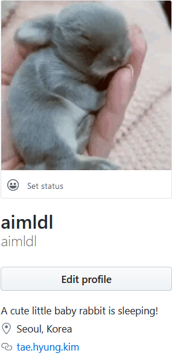

##### aimldl/VOX/worklog/week004-20200321(Sat)~0327(Fri).md

## Done
2020-03-26(목)
* Docker로 pytorch환경 baseImage 만듬: "aimldl/baseimage_pytorch1.4.0_python3.7.6_conda_4.8.2_ubuntu18.04.4"
  * "aimldl/baseimage_python3.7.6_conda_4.8.2_ubuntu18.04.4"에 pytorch, torchvision, torchaudio, torchtext를 설치
* Profile이름 작명함.
  * 프로필 사진을 아래로 바꿨더니 방문 시 기분이 좋음! 매번 "아~ 귀여워~ (So adorable!)"을 외치게 됨.
  

  * 저녁 11시 넘어서 "Edit Profile"을 누르고 싶은 마음이 생김. 위의 그림에서 aimldl을 풀어서 쓰면 어떨까?라는 생각이 들었음.
  * thesaurus.com에서 각 단어의 동의어를 찾아서 aimldl에 매핑 시켜봄.
  * "adorable & immature midget lagomorph is dreaming" 마지막 l이 마땅치 않아서 싱글리쉬처럼 dreaming la~로 해봤지만 뭔가 어색함.
  * adorable immature midget lagomorph's dream land로 변경. 마음에 들었음.
  * adorable & immature midget lagomorph's dream land. 가독성을 높이기 위해서 &를 포함. 10분도 안 걸린 것 같으나 뭔가 좋은 이름을 찾은 듯?
