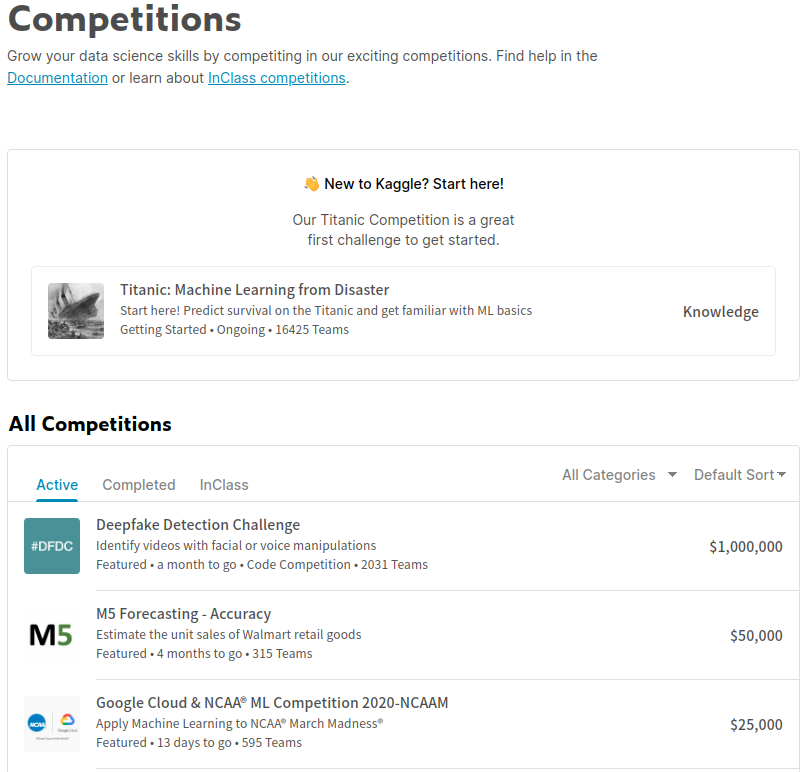
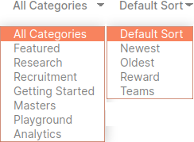
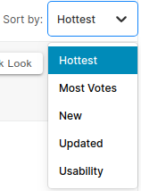
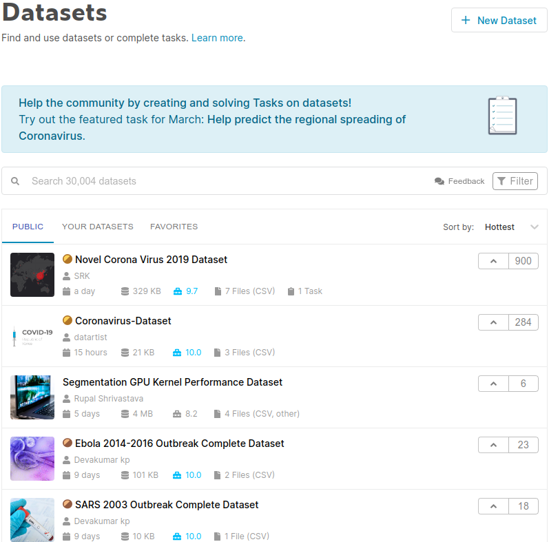
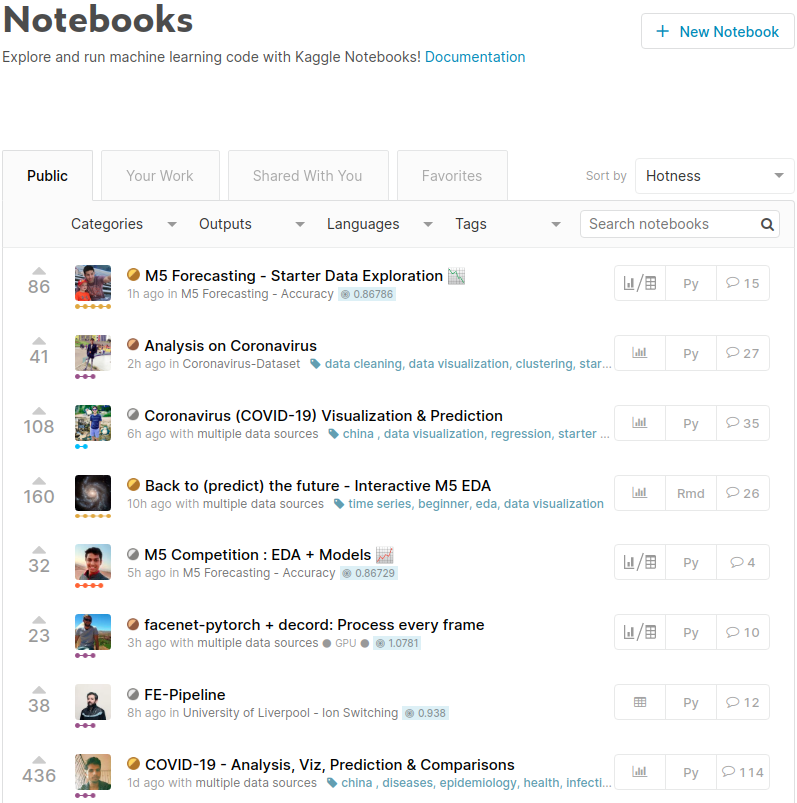
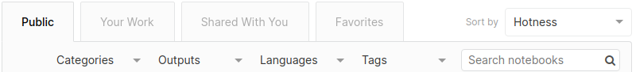
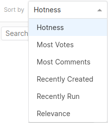
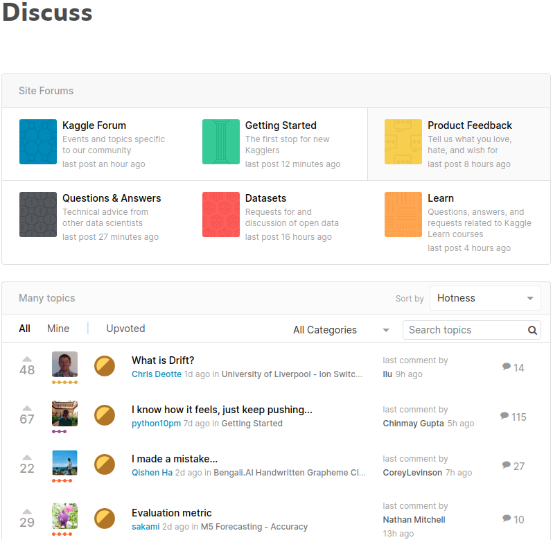
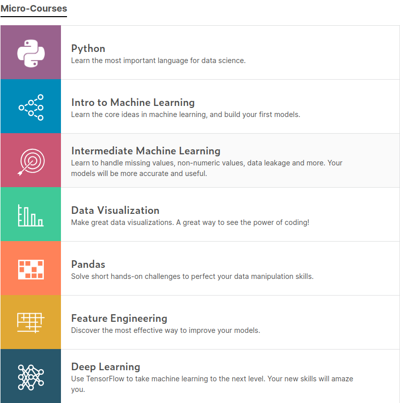
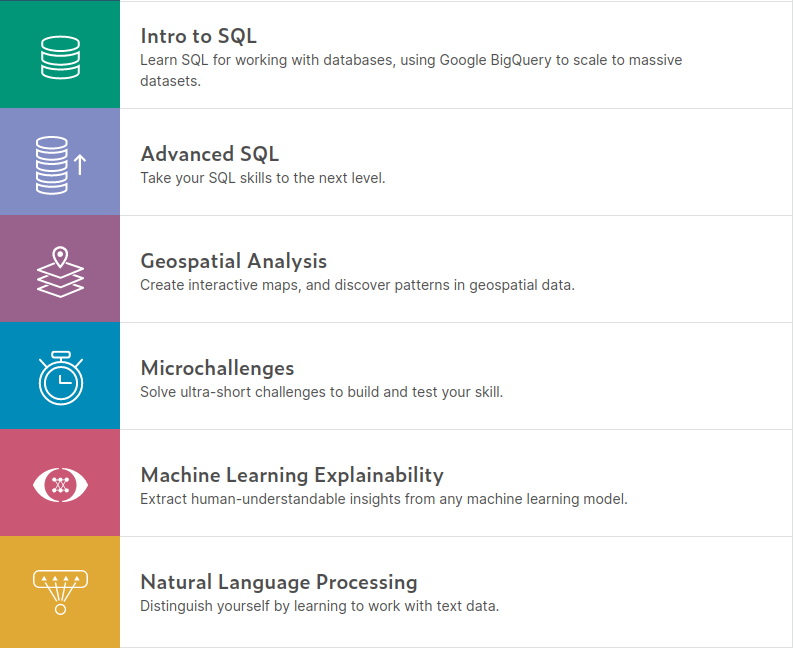

##### aimldl/VOX/kaggler/1_Novice_Competitions/README.md
* Rev.1: 2020-03-07 (Sat)
* Draft: 2020-03-06 (Fri)

# Level 1 - Novice in Competitions
## 캐글 홈페이지
### 회원 가입
[캐글 홈페이지](https://www.kaggle.com/), https://www.kaggle.com/에서 회원가입을 합니다. 그러면 첫 미션은 클리어입니다. 참 쉽죠? 캐글의 공용어는 영어입니다. 만약 영어에 익숙치 않다면, 영어를 잘 하는 친구/동료와 팀을 구성해보세요.

### My Profile
홈페이지 로그인을 해서 본 "My Profile"입니다.

회원 가입 직후에는 4개 활동영역의 레벨이 모두 Novice (입문자)입니다. 약간의 활동으로 누구나 Contributor (초급자)가 될 수 있지만, 상당량의 경기 실적이 필요한 Expert (전문가; 중급자)가 되기 위해서는 꽤 많은 시간과 노력이 요구됩니다. Master (마스터; 상급자)와 Grandmaster (그랜드마스터; 최상급자)가 되기 위해서는 오랜 시간, 많은 노력을 통해 꾸준한 성적을 내야합니다.

캐글의 활동영역(4개)과 레벨(5개)를 아래 표에 정리해봤습니다.

| 활동영역 \ 레벨 | Novice | Contributor | Expert | Master | Grandmaster |
| ------------ | ------ | ----------- | ------ | ------ | ----------- |
| Competitions |        |             |        |        |             |
| Datasets     |        |             |        |        |             |
| Notebooks    |        |             |        |        |             |
| Discussion   |        |             |        |        |             |

* 활동영역: Competitions, Datasets, Notebooks, Discussion
* 레벨: Novice, Contributor, Expert, Master, Grandmaster

## 캐글 홈페이지 둘러보기

첫 번째 목표를 이야기 하기 전에 우선 캐글 홈페이지를 둘러보고 환경에 익숙해집니다. 바로 첫 번째 문제에 도전할 실력이 된다면 도전하는 것도 좋을 것입니다. 하지만 먼저 환경에 익숙해지고자 하는 이유는 대부분의 사람들은 캐글에 대한 두려움이 있기 때문입니다. "Kaggle For Beginners With Kernel Code"의 저자 우스마니 박사님 (Dr. Usmani)은 7장의 서두에서 대략 아래와 같이 말했습니다.

캐글을 막 시작하는 사람들이 궁금해하는 것은 내 실력이 경기 (Competitions)에 임할 만큼 충분하지 않은 것은 아닌가라는 의문이다. 이것은 물에 대한 두려움이 수영을 배우기 시작할 용기를 가지기를 막는 것과 비슷하다. 물에 들어가보기 전까지 얼마나 깊은지 모르듯이, 경기를 해보기 전까지는 이길 수 없다고 생각하지 마라.

> The most critical question most data science enthusiasts face when starting out on Kaggle is whether they are skilled enough to compete favorably in Kaggle competitions. This is similar to fearing water that prevents you from having the courage to start swimming. As you cannot find how deep is water until you get in, do not assume you cannot win until you try. -"7. Kaggle Tutorials"

두려움. 그리고 용기. 저는 이 글을 읽고 '아, 나만 두려운 것이 아니구나. 이 책을 사기 잘 했다'라는 생각이 들었습니다. 책을 구매하기 전에 Amazon.com에서 Kaggle 홈페이지를 설명한 것 외에는 별 내용이 다없다는 Review을 읽었기 때문에 구매를 살짝 주저했었거든요. 캐글에 가입한 후 몇 가지 이유로 경기에 임하지 않았고, 저에게 캐글 계정이 있다는 사실마져 잊어버리고 있었으니까요. 누구나 이런 종류의 두려움을 느낀다는 것을 알고는 아주 조금 용기가 생겼습니다.

두려움은 무지에서 오기도 합니다. 그래서 알게 되면 덜 두려워질 수도 있습니다. 홈페이지를 둘러보는 것은 물가 근처를 어슬렁 어슬렁 돌아다니는 것과 비슷한 것 같아요. 근처에 가서 관찰을 하고 나중에 필요한 정보를 조금 알아내면서 마음의 준비를 하는 것이죠. 그리고 이 정보를 바탕으로 지상훈련을 통해 조금씩 몸을 만들어갈 수도 있을 것 같습니다. 물에 들어가는 날을 위해서...

### 순서

아래에서는 세가지 내용을 둘러보겠습니다.

1. 캐글 홈페이지의 메뉴

   * 메뉴의 내용을 둘러보며 캐글의 활동영역에 대해 한단계 더 깊게 알아봅니다.

2. 선배 캐글러 (Kaggler)

   * 참고로 할만한 캐글러 선배를 발견해서 롤모델로 삼아봅니다. 선배님!

   캐글 홈페이지와 관련된 전반적인 내용은 [kaggle/README.md](https://github.com/aimldl/VOX/blob/master/kaggle/README.md)에 별도로 정리합니다. 참고하세요.

### 캐글 홈페이지의 메뉴 둘러보기

먼저 홈페이지의 메뉴를 둘러봅니다. 우리가 잘 하는 웹브라우징... 클릭 몇 번으로 큰그림을 볼 수가 있지요.

캐글의 주요 기능에는 Compete, Data, Notebooks, Discuss 그리고 Courses가 있습니다. Courses를 제외한 각 주요 메뉴는 레벨이 매겨지는 4개의 영역 (Competitions, Datasets, Notebooks, Discussion)과 연관이 있습니다. 그러므로 각 메뉴에 대해 한단계 더 깊이 들어가 봅니다.

#### Compete 메뉴

Compete를 클릭하면 경기 (Competitions) 관련 페이지가 열립니다. "New to Kaggle? Start here!"에서는 첫 프로젝트로 "타이타닉 문제 (Titanic: Machine Learning from Disaster)"를 권합니다. 그 밑에는 모든 경기 (All Competitions)가 보여집니다. (꽤 많은 경기가 진행 중이지만 첫 3개만 표시되었습니다.)

"All Competitions" 아래의 탭을 유심히 보면 Active, Completed, InClass로 나뉘어져있고, 경기 리스트를 카테고리별로 정렬할 수 있다는 것을 알 수 있습니다. 아래 그림의 카테고리는 All Categories, 정렬방식은 Default Sort로 되어 있는데 몇 가지로 선택할 수 있습니다.

예를 들면, 카테고리를 "Getting Started", 정렬방식을 "Newest"로 하면 아래와 같이 나옵니다. 위에서 첫 프로젝트로 추천된 타이타닉 문제도 있고, 딥러닝 프레임워크 (TensorFlow, Keras, PyTorch 등)의 "Hello, world"문제라고 불리는 "MNIST 문제 (Digit Recognizer)"도 보입니다.

이런 문제들의 오른쪽엔 "Knowledge"라고 되어 있는데, 특이하게 "$10,000"라고 된 것이 하나 있네요. 이 우측 항목은 경기에 임하므로써 얻을 수 있는 것을 나타냅니다. "Getting Started"문제는 경기 혹은 프로젝트 종료 후  지식 (Knowledge)만 얻는 것이 대부분인데, 1만달러 (\$10,000, 한화 약 1189만원)를 획득할 수 있는 Active 프로젝트가 있군요.

운이 좋네요! 동기부여가 팍!팍!됩니다. 몸에 아드레날린이 분비되면서 눈과 머리가 맑아지고 빨리 하고 싶다는 생각이 마음 속을 떠나지 않네요. 이 느낌이 계속 됐으면 좋겠어요. 아~ 천만원이나 생기면 그 돈으로 뭘 하죠?

둘러볼껀 빨리 둘러보고 후딱후딱 첫 프로젝트에 돌입합시다. 우선 타이타닉 문제를 풀어 캐글의 플랫폼에 대해 익숙해진 다음 1만달러을 헌팅하러 가보도록 합시다. There's no time to lose! Let's get it started!

#### Data 메뉴

메뉴에서 Data를 클릭하면 데이터셋 (Datasets) 관련 페이지가 열립니다. 서치박스에서 전체 데이터셋의 개수를 알려줍니다. 현재 총 30,005개가 있네요. 3종류의 탭 (PUBLIC, YOUR DATASETS, FAVORITES)가 있고, 몇 가지 방식으로 정렬도 가능합니다.

디폴트인 Hottest, 즉 가장 핫한 데이터셋을 보면 바이러스와 관련된 것이 상위권에 위치합니다. "Novel Corona Virus 2019 Dataset", "Coronavirus-Dataset"와 같이 코로나 바이러스가 1, 2위를 차지하는데 현시점 (2020년 3월초)에서 코로나 바이러스가 현생 인류에 위협이 되는 큰 문제이기 때문인 것 같습니다. 캐글이 시사성이 높은 커뮤니티라는 것을 알 수 있네요.

위 그림의 서치박스 우측에 있는 "Filter"를 클릭하면 아래와 같은 필터링 조건이 나옵니다. 원하는 조건의 데이터셋만을 고를 수 있어서 편리한 기능입니다.

"Only Datasets with Tasks" 항목을 체크하면 Task가 있는 데이터셋만 고를 수 있습니다. 반대로 말하면 주어진 데이터셋에 Task가 없을 수도 있다는 것이므로, 당분간은 데이터셋을 판별하는 기준으로 삼아도 좋겠네요. 캐글 혹은 머신러닝 문제에 어느 정도 숙련되어 데이터셋에서 Task를 스스로 정의할 수 있을 때까지는 Task가 없는 문제는 피하는게 좋을 것 

캐글의 같습니다.

#### Notebooks 메뉴

메뉴에서 Notebooks를 클릭하면 노트북 (Notebooks) 관련 페이지가 열립니다. 코로나 바이러스 (Coronavirus 혹은 COVID-19)와 관련된 노트북이 상위권에 있는 걸로 봐서 시사성이 굉장히 높은 글을 써서 노트북에 공유하네요. 캐글러들 대단합니다! Respect!

탭으로는 Public, Your Work, Shared With You, Favorites가 있습니다. 직접 작성한 노트북은 Your Work에서 볼 수 있습니다. 다른 사람들이 작성한 노트북은 Public에 있는데 노트북을 공유하고 즐겨찾기에 넣어놓을 수도 있어서, 공유된 노트북은 Shared With You에 즐겨찾기에 넣어둔 것은 Favorites에서 찾을 수 있습니다.

각 탭에 있는 노트북은 아래처럼 몇 가지 방식으로 정렬도 가능하구요.

#### Discuss 메뉴

메뉴에서 Discuss를 클릭하면 의견교환 (Discuss) 관련 페이지가 열립니다. Site Forums와 Many topics로 나뉘어지므로, 문제를 풀다가 막히거나 다른 사람의 의견이 필요할 경우에 유용하게 쓰일 수 있습니다.

#### Courses 메뉴

메뉴에서 Courses를 클릭하면 코스 (Courses) 관련 페이지가 열립니다. 캐글 문제를 풀기에 적합한 실질적인 문제를 발췌해서 수업을 만들었다고 하네요. 소규모 온라인 수업 (Micro-Courses)로 구성되어 전체 과정 (Full Course)를 들어야하는 다른 과정에 비해 상대적으로 짧은 시간에 필요한 기술 (Skills)을 복습하기에 좋습니다. 가격이 무료인데 내용이 훌륭합니다.

단점은 설명이 길지 않기때문에 처음 배우는 분께는 어려울 수 있고, 모든 수업이 영어로 제공된다는 것입니다. 언어에 장벽이 없거나 적으시다면 캐글에 적응하기 위해 굉장히 유용할 수 있습니다.

#### 요약: 캐글 홈페이지
캐글 홈페이지의 메뉴의 내용을 둘러본 내용을 정리해봅니다. 메뉴의 각 메뉴는 캐글의 활동 영역에 해당합니다. 각 영역별 레벨은 Novice (입문자)로 시작해서, Contributor (초급자), Expert (전문가; 중급자), Master (마스터; 상급자), Grandmaster (그랜드마스터; 최상급자) 순서로 올라갑니다.

현재 자신의 레벨을 보려면 웹페이지 우측 상단의 사진을 클릭해서 "My Profile"을 선택하면 됩니다. 회원 가입 직후에는 아래처럼 모든 활동영역에서 Novice (입문자)입니다.

캐글에서 활동하면서 가장 중요한 영역이 경기 (Competitions)라는 것을 잊어선 안 됩니다. 하지만 경기에 매번 이길 수 없습니다. 이것을 실패로 여기지 않고, 한 두번의 성공에 집착하기 보다는 꾸준한 성장에 초점을 맞추기 위해 나머지 활동영역을 효율적으로 사용하면 좋을 것 같습니다. 꾸준히 한발 한발 나가면 조금 더 목표에 가까워져있을 것입니다.

#### 다음 주제: [선배 캐글러 (Kaggler) 둘러보기](senior_kagglers.md)
참고로 할만한 캐글러 선배를 발견해서 롤모델로 삼아봅니다. 선배님!
