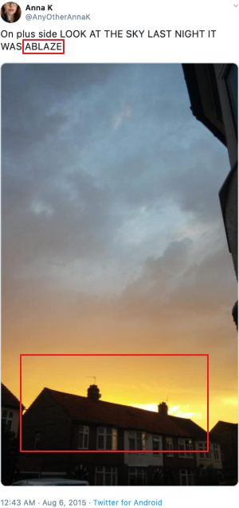

##### aimldl/VOX/kaggler/compete-level1_novice/project-disaster_prediction_from_tweets/README.md
* Draft: 2020-03-08 (Sun)

# Disaster Prediction from Tweets
This is one of "Getting Started Prediction Competition" at [kaggle.com](https://www.kaggle.com/). This project is stimulating thanks to the prize money and mentally rewarding from a sense that I can help the humanity. If my prediction model works well, someone's life may be saved. With hope such a disaster won't happen, let's use it as an internal motivation. :-)

The competition page is at [Real or Not? NLP with Disaster Tweets](https://www.kaggle.com/c/nlp-getting-started/overview/description).

## Analysis of the Competition Page
Let's do the homework first. 

## Overview > Description
### Competition Description
* Build a machine learning model that predicts
  - which Tweets are about real disasters and
  - which one’s aren’t.
* A dataset of 10,000 tweets that were hand classified is provided.

The following tweet is an example that is NOT a disaster.

> The author explicitly uses the word “ABLAZE” but means it metaphorically. This is clear to a human right away, especially with the visual aid. But it’s less clear to a machine.

#### What's the motivation behind challenging this competition?
Twitter has become an important communication channel in times of emergency.
The ubiquitousness of smartphones enables people to announce an emergency they’re observing in real-time. Because of this, more agencies are interested in programatically monitoring Twitter (i.e. disaster relief organizations and news agencies).

But, it’s not always clear whether a person’s words are actually announcing a disaster.
