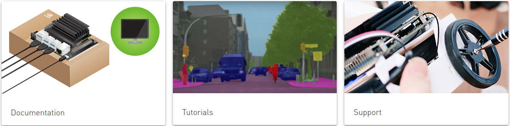

* Draft: 2020-10-12 (Mon)

# NVIDIA Jetson

## Introduction

> **Nvidia Jetson** is a series of embedded computing boards from [Nvidia](https://en.wikipedia.org/wiki/Nvidia). The Jetson TK1, TX1 and TX2 models all carry a [Tegra](https://en.wikipedia.org/wiki/Tegra) processor (or SoC) from Nvidia that integrates an [ARM architecture](https://en.wikipedia.org/wiki/ARM_architecture) [central processing unit](https://en.wikipedia.org/wiki/Central_processing_unit) (CPU). Jetson is a low-power system and is designed for accelerating [machine learning](https://en.wikipedia.org/wiki/Machine_learning) applications.[[1\]](https://en.wikipedia.org/wiki/Nvidia_Jetson#cite_note-1)
>
> Source: [Nvidia Jetson, Wikipedia](https://en.wikipedia.org/wiki/Nvidia_Jetson)

Homepage: https://developer.nvidia.com/embedded-computing

## [Jetson Modules](https://developer.nvidia.com/embedded/jetson-modules)

### [Jetson Nano](https://developer.nvidia.com/embedded/jetson-modules#jetson_nano)

#### [Jetson Nano 2GB Developer Kit](https://developer.nvidia.com/embedded/buy/jetson-nano-2gb-devkit)

#### [Jetson Nano Developer Kit](https://developer.nvidia.com/embedded/buy/jetson-nano-devkit)

#### [Jetson Nano](https://developer.nvidia.com/embedded/buy/jetson-nano)

### [Jetson Xavier NX](https://developer.nvidia.com/embedded/jetson-modules#jetson_xavier_nx) 

### [Jetson AGX Xavier Series](https://developer.nvidia.com/embedded/jetson-modules#jetson_agx_xavier)[*](https://developer.nvidia.com/embedded/jetson-modules#jetson_agx_xavier_industrial)

#### [Jetson Xavier NX Developer Kit](https://developer.nvidia.com/embedded/jetson-xavier-nx-devkit)

#### [Jetson Xavier NX](https://developer.nvidia.com/embedded/jetson-xavier-nx)

#### [Jetson AGX Xavier Developer Kit](https://developer.nvidia.com/embedded/buy/jetson-agx-xavier-devkit)

#### [Jetson AGX Xavier](https://developer.nvidia.com/embedded/buy/jetson-agx-xavier)

### [Jetson TX2 Series](https://developer.nvidia.com/embedded/jetson-modules#jetson_tx2)

#### [Jetson TX2 Developer Kit](https://developer.nvidia.com/embedded/buy/jetson-tx2-devkit)[Jetson TX2](https://developer.nvidia.com/embedded/jetson-tx2)

* Built around an NVIDIA Pascal™-family GPU

* 8GB of memory and 59.7GB/s of memory bandwidth
* Features a variety of standard hardware interfaces

#### [Jetson TX2](https://developer.nvidia.com/embedded/buy/jetson-tx2)

#### [Jetson TX2i](https://developer.nvidia.com/embedded/buy/jetson-tx2i)

#### [Jetson TX2 4GB](https://developer.nvidia.com/embedded/buy/jetson-tx2-4gb)

#### [Jetson TX1](https://developer.nvidia.com/buy-jetson?product=jetson_tx1&location=US)

**What can I do with Nvidia Jetson?**

Many developers use **Jetson** for deploying vision and neural net processing onboard mobile platforms like autonomous robots, drones, IoT, handheld medical devices, intelligent vehicles & dashcams, ect. Others use it for home automation, smart appliances (like June oven), IP cameras, low-power HTPC / media centers, ect.

[What can I do with a Jetson TX2? - NVIDIA Developer Forums](https://forums.developer.nvidia.com/t/what-can-i-do-with-a-jetson-tx2/48419)

**How much does a Jetson cost?**

NVIDIA **Jetson** Nano is a $99 Raspberry Pi Rival for AI Development. At the GPU Technology Conference NVIDIA announced the **Jetson** Nano Module and the **Jetson** Nano Developer Kit. Compared to other **Jetson** boards which **cost** between $299 and $1099, the **Jetson** Nano bears a low **cost** of $99. Mar 22, 2019

[NVIDIA Jetson Nano is a $99 Raspberry Pi Rival Built for AI - It's FOSS](https://itsfoss.com/nvidia-jetson-nano/)

> Various operating systems and software might be able to run on the Jetson board series.
>
> **Linux**
>
> JetPack is a [Software Development Kit](https://en.wikipedia.org/wiki/Software_Development_Kit) (SDK) from Nvidia for their Jetson board series. It includes the [Linux for Tegra](https://en.wikipedia.org/wiki/Linux_for_Tegra) (L4T) operating system and other tools. The official Nvidia download page bears an entry for JetPack 3.2 (uploaded there on 2018-03-08) that states:
>
> > JetPack 3.2 adds support for the Linux for Tegra r28.2 image for the Jetson OS. It is packaged with newer versions of Tegra System Profiler, [TensorRT](https://en.wikipedia.org/w/index.php?title=TensorRT&action=edit&redlink=1), and [cuDNN](https://en.wikipedia.org/w/index.php?title=CuDNN&action=edit&redlink=1) from the last release.[[12\]](https://en.wikipedia.org/wiki/Nvidia_Jetson#cite_note-12)
>
> RedHawk Linux is a high-performance RTOS available for the Jetson platform, along with associated NightStar real-time development tools, CUDA/GPU enhancements, and a framework for hardware-in-the-loop and man-in-the-loop simulations. [[13\]](https://en.wikipedia.org/wiki/Nvidia_Jetson#cite_note-13)
>
> **QNX**
>
> The [QNX](https://en.wikipedia.org/wiki/QNX) operating system also available for the Jetson platform, though it is not widely announced. There are success reports of installing and running specific QNX packages on certain Nvidia Jetson board variants. Namely the package *qnx-V3Q-23.16.01* that is seemingly in parts based on Nvidia's [Vibrante](https://en.wikipedia.org/wiki/Vibrante) Linux distribution is reported to run on the Jetson TK1 Pro board.[[14\]](https://en.wikipedia.org/wiki/Nvidia_Jetson#cite_note-14)

## [Jetson Developer Kits](https://developer.nvidia.com/embedded/jetson-developer-kits)

Jetson Developer Kit Lineup

* [Jetson Nano 2GB Developer Kit](https://developer.nvidia.com/embedded/jetson-nano-2gb-developer-kit) 

* [Jetson Nano Developer Kit](https://developer.nvidia.com/embedded/buy/jetson-nano-devkit)

* [Jetson TX2 Developer Kit](https://developer.nvidia.com/embedded/buy/jetson-tx2-devkit)

* [Jetson Xavier NX Developer Kit](https://developer.nvidia.com/embedded/jetson-xavier-nx-devkit)

* [Jetson AGX Xavier Developer Kit](https://developer.nvidia.com/embedded/buy/jetson-agx-xavier-devkit)

## Tutorials

Check out the [Tutorials](https://developer.nvidia.com/embedded/learn/tutorials) page for a full range of educational videos on how to develop with Jetson, including:

- [Jetson AI Fundamentals Series](https://developer.nvidia.com/embedded/learn/jetson-ai-certification-programs#course_outline)
- [Getting Started with AI on Jetson Nano](https://courses.nvidia.com/courses/course-v1:DLI+C-RX-02+V1/about)
- [Hello AI World](https://github.com/dusty-nv/jetson-inference)
- [JetBot autonomous robot kit](https://www.nvidia.com/en-us/autonomous-machines/embedded-systems/jetbot-ai-robot-kit/)
- https://github.com/NVIDIA-AI-IOT/jetracer
- https://github.com/NVIDIA-AI-IOT/trt_pose
- https://github.com/NVIDIA-AI-IOT/torch2trt

## Purchase

### NVIDIA Jetson Nano Developer Kit

* [$99.0 at amazon.com](https://www.amazon.com/NVIDIA-Jetson-Nano-Developer-945-13450-0000-100/dp/B084DSDDLT/ref=sr_1_1?dchild=1&keywords=nvidia+jetson+nano&qid=1602487462&sr=8-1) + $8.53 (Shipping to Korea)

* #### Frequently bought together

  * [SMAKN DC 5V/4A 20W Switching Power Supply Adapter 100-240 Ac(US)](https://www.amazon.com/SMAKN-Switching-Supply-Adapter-100-240/dp/B01N4HYWAM/ref=pd_bxgy_img_2/144-3300222-3373205?_encoding=UTF8&pd_rd_i=B01N4HYWAM&pd_rd_r=b8b161a6-d236-46cd-a7b9-1572143ab1e6&pd_rd_w=4Jc9A&pd_rd_wg=kdj60&pf_rd_p=ce6c479b-ef53-49a6-845b-bbbf35c28dd3&pf_rd_r=CE4BN298MSCSB4S9MWY2&psc=1&refRID=CE4BN298MSCSB4S9MWY2)

  * $9.99 at amazon.com

    

> This is my fourth purchase of a Jetson nano and it is perfect for Deep Learning AI classification and detection using OpenCv or TensorFlow.

> Pros: Can handle 4K@60Hz
> Cons: Have no ideas how to power this device
> I tried to power the board with barrel jack and pin header, and I always get the "throttle warning" in 10W power mode. I tried my 5.25V 3A power brick, which works with my Tinker Board S reliably - throttle warning. I tried bench power supply (5A max) - throttle warning. I tried to increase the voltage up to 5.4V - not a big difference, it still throttles in 10W mode under a load. The voltage is well above 4.75V, I can't see any voltage sag at exposed 5V/GND pins. As for peripherals connected to the device, there are low power WiFi dongle and wireless kbd/mouse whistle. Am I need to solder 10AWG wires directly to CPU and plug this junk directly to mains?
>
> Upd: throttling issues are exclusive to to display resolution. There are no undervoltage warning if full HD resolution is set. Turn the slider up to 4K - you'll get warnings again.

> Wi-Fiモジュール（8265NGW）とアンテナ（Econlineshop 3dBi デュアルバンド 802.11a/b/g/n/ac対応 WIFI/Wimax/Bluetoothモジュール用アンテナ MHF4 MHF4-50）を別途購入し使用していますが問題なく動いてます。耐久性は買ったばかりなのでわかりません。

#### [8265NGW at amazon.com](https://www.amazon.com/s?k=8265NGW&ref=nb_sb_noss_2)

Dual Band Wireless- AC 8265 8265AC NGFF WiFi Card 8265 AC AC8265 8265NGW M.2 NGFF 2.4/5GHz Bluetooth 4.2 Wireless WiFi Card 867 Mbps, [$18.00 at amazon.com](https://www.amazon.com/Wireless-8265AC-8265NGW-Bluetooth-Wireless/dp/B07V51ML6V/ref=sr_1_3?dchild=1&keywords=8265NGW&qid=1602487958&sr=8-3)

#### [MHF4 MHF4-50 at amazon.com](https://www.amazon.com/s?k=MHF4+MHF4-50&ref=nb_sb_noss)

TODO: 안테나 인듯 하나 찾기 힘들었음.

[괴물스펙 IoT 개발보드 2종 :: #라즈베리파이4 vs NVIDIA #Jetson Nano #젝슨나노](https://blog.naver.com/makepluscode/221577141552)

vs.

