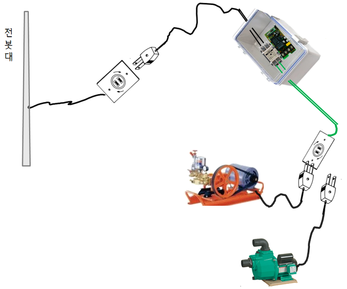

* Rev.1: 2020-10-19 (Mon)
* Draft: 2020-10-12 (Mon)

# 비둘기 퇴치

Google search: 비둘기 쫓아내기

[비둘기를 쫓아 버리는 방법](https://myanimals.com/ko/animals/7-ways-to-scare-off-pigeons/)

> 1. 오래된 CD: 태양이 CD의 표면에 반사되면, 빛의 밝기가 비둘기의 눈을 아프게 한다.
>
> 2. 물과 향신료
>
> 3. 경사진 새 장벽
>
> 4. 그물
>
> 5. 플라스틱 올빼미와 까마귀
>
> 6. 은색 물체
>
> 7. 물
>
>     스프링클러나 혹은 식물에 주기적으로 물을 주는 다른 장치의 (타이머가 달린) 설치를 필요로 한다. 물은 비둘기를 놀라게 할 것인데, 왜냐하면 비둘기는 물을 전혀 좋아하지 않기 때문이다.

Google search: pigeon expel

[pigeon expel, wikiHow](https://www.wikihow.com/Get-Rid-of-Pigeons)

> Spray pigeons with water from a garden hose. Pigeons won't appreciate the force or concentration of the water being targeted at them. Spray the birds when they first arrive. If you wait until they set up house, it will be too late.[11]

Google search: 기지국 안테나 비둘기

소리: [공군의 조류퇴치팀 (BAT)가 사용하는 방법[토야마 슈퍼젯 회전형 고압 분사기로 비둘기똥 청소후기 강력추천](https://blog.naver.com/jdance01/221998688975)](http://blog.daum.net/choogal/16511466)

> 활주로 주변에 설치된 30여 대의 자동폭음기는 2분마다 '쾅'하는 폭음과 새들이 싫어하는 맹금류 소리를 번갈아 내질러 새들의 접근을 막는다. (...) 아무리 신형 장비를 설치해도 새들은 처음엔 움찔하다 몇칠 만에 적응해 퇴치효과가 지속되기는 힘들다고 현 준위는 설명했다. (...) 과거 무조건 총을 쏴 새를 잡던 퇴치에서 지금은 새와 공존하기 위한 환경친화적인 퇴치에 역점을 두고 있다.

[한국-공군/조류퇴치팀(BAT)](https://www.google.com/imgres?imgurl=https%3A%2F%2Ft1.daumcdn.net%2Fcfile%2Fblog%2F185B69404EC0A61928&imgrefurl=http%3A%2F%2Fblog.daum.net%2Fchoogal%2F16511466&tbnid=SR8gPbV32uoHvM&vet=10CBsQMyhyahcKEwi4gLSZ0q7sAhUAAAAAHQAAAAAQAg..i&docid=B8mvn6cOume0PM&w=500&h=287&q=%EB%B9%84%EB%91%98%EA%B8%B0%20%EC%AB%93%EC%95%84%EB%82%B4%EA%B8%B0&ved=0CBsQMyhyahcKEwi4gLSZ0q7sAhUAAAAAHQAAAAAQAg)

4, 비둘기, 또는, 비둘기, 자리잡았다, 통하고 있는, british, 텔레비젼 공중선, 통하고 있는, 돛대, 통하고 있는, 흐린 일

[Google search: pigeon damaging antenna](https://www.google.com/search?q=pigeon+damaging+antenna&newwindow=1&sxsrf=ALeKk00NtLtkxpgzjFuuIRBHD0DCCDUDjQ:1602489906688&source=lnms&tbm=isch&sa=X&ved=2ahUKEwixoZONzK7sAhXI3mEKHe6gAsUQ_AUoAXoECCkQAw&biw=1853&bih=920)

[방아쇠 가동 물분사 총 후에 튼튼한 냉각 물뿌리개](http://korean.milkingmachinespareparts.com/sale-10191323-durable-cooling-sprinklers-after-trigger-operation-water-spray-gun.html)

## 특허 검색

키프로스 검색: 비둘기 퇴치

Total 168 Articles (1 / 6 Pages)

[등록](javascript:void(newPopupWindow('http://www.kipris.or.kr/khome/help/help01/help01_2.jsp#chapter3','HelpWin',820, 800, 'C', 'M', 'scrollbars=yes'));) [49] [사물인터넷 기반 능동형 조류**퇴치**장치(ACTIVE TYPE BIRDS-REPELLING APPARATUS BASED ON INTERNET OF THINGS)](javascript:openDetail(1020180080476, 18, '', 'biblio', '30', 'View01'))

키프로스 검색: 조류 퇴치

Total 1,920 Articles (1 / 64 Pages), 33page까지 확인했으나, 마지막 5페이지 정도는 전혀 무관한 내용이 있어서 33에서 중담.

 [41] [지능형 유해**조류** 및 야생동물 **퇴치** 장치(Intelligent type device that scare away noxious birds and wild animals for crops)](javascript:openDetail(2020130002094, 10, '', 'biblio', '30', 'View01'))

[등록](javascript:void(newPopupWindow('http://www.kipris.or.kr/khome/help/help01/help01_2.jsp#chapter3','HelpWin',820, 800, 'C', 'M', 'scrollbars=yes'));) [76] [무인 로봇을 이용하여 **조류**를 **퇴치**하기 위한 시스템 및 그 방법(SYSTEM FOR REPELLING BIRDS USING UNMANNED ROBOT AND METHOD THEREOF)](javascript:openDetail(1020110055482, 15, '', 'biblio', '30', 'View01'))

[소멸](javascript:void(newPopupWindow('http://www.kipris.or.kr/khome/help/help01/help01_2.jsp#chapter3','HelpWin',820, 800, 'C', 'M', 'scrollbars=yes'));) [81] [**조류** **퇴치**장치(drive birds out of apparatus)](javascript:openDetail(2020030015970, 20, '', 'biblio', '30', 'View01'))

[등록](javascript:void(newPopupWindow('http://www.kipris.or.kr/khome/help/help01/help01_2.jsp#chapter3','HelpWin',820, 800, 'C', 'M', 'scrollbars=yes'));) [313] [IoT 딥러닝 카메라와 인식기술을 사용한 IoT 융복합을 통한 지능형 유해동물과 **조류** 방제장치를 이용한 방제방법(Equipment for controlling harmful animals using IoT deep learning)](javascript:openDetail(1020180007540, 12, '', 'biblio', '30', 'View01'))

[등록](javascript:void(newPopupWindow('http://www.kipris.or.kr/khome/help/help01/help01_2.jsp#chapter3','HelpWin',820, 800, 'C', 'M', 'scrollbars=yes'));) [426] [**조류**둥지 발생 보고 시스템 및 **조류**둥지 발생 보고 방법(BIRDEHFB NEST OCCURRENCE REPORTING SYSTEM AND REPORTING METHOD)](javascript:openDetail(1020180023939, 5, '', 'biblio', '30', 'View01'))

## Naver 검색: "비둘기 물 분사기" 검색결과

### (끔찍한) 비둘기 처리 경험담

아파트 베란다의 에어컨 실외기를 보관하는 작은 공간에 비둘기 둥지를 발견하고 곤란한 상황에 처한 경험에 관한 블로그입니다.

> 새끼를 두마리 낳아 놓은 둥지를 발견 하였습니다. 배설물들이 많이 쌓여 있는 것도 보입니다. 비둘기 배설물에  살모낼라균이 식중독을 유발 할 수 있다고 하여  이놈들을 퇴치 하려고 여기 저기  연락을 취해 봤습니다.  
>
> \- 아파트 관리 사무실 연락  :   살아있는 생물이라 관리실에서 처리 할 방도가 없다고 합니다. 119에 신고 해 보라는 군요~~
>
> \- 119에 연락 :  개, 고양이는 하는데  조류는 하지 않는다고 합니다.
>
> \- 주민센터에 연락 :  시청 축산과에 연락 해 보라는 군요..
>
> \- 화성시청 축산과 연락 :  개, 고양이등 동물에 관련 해서 처리만 한다고   수진관리과에 연락 하라고 합니다.
>
> \- 화성시청 수질관리 과  : (( 아파트 베란다  어미비둘기, 새끼 두마리 처리 문의 입니다. )) 했는데 "공무원은 안내방송 로봇기계처럼 조류기피제가 다 떨어져서  지금은 지급 할 수없습니다." 라고 합니다. (( 지금은 조류 기피제가 우선이 아니고  현재 둥지에 어미 두마리, 새끼 두마리 어떻게 처리 할 수 있습니까 ? )) 비둘기 수거 업체에 연락 해서 잡아 가도록 조치를 취해 준다고 합니다. (( 비둘기 둥지 배설물은 어떻게 처리 해 주십니까 ? )) "그것은 처리 해 주지 않습니다. 주민 자체적으로 처리 해야 합니다."
>
> 비둘기 처리 업체가 왔을 때는  어미 비둘기 둘은 도망가고  새끼는 수거해 갔고, 데려가서 안락사시켜서 처리한다고 합니다. 워낙 비둘기 숫자가 많고 신고 건수가 많아 그렇게 처리 한다고 합니다.
>
> 환경문제는 남아 있는  비둘기 배설물 입니다.  이것은 처리 하는 곳이 없는가요 ? 에어콘 실외기 베란다는 좁디 좁은데  어떻게 청소해야 할 지 어렵운 문제 입니다.
>
> *-*-*-*-*-*-*-*-*-*-*-*-*-*-*-*-*-*-*-*-*-*-*-*-*-*-*-*-*-*-*-*-*-*-*-*-*
>
> 어디에서도 베란다 비둘기 집 청소를 도움 받을 길이 없었습니다. 그래서 사진의 초강력 고압분사기를  미리 준비해 뒀다가 태풍바비가 지나가는 새벽에  비둘기똥 을 고압분사기로 깨끗이 청소했습니다. 15층 아파트이기 때문에  맑은날 청소했을 경우 아래 층에 피해가 가기 때문에 비가 많이 오는 날 태풍바비가 지나가는 날 새벽에 했습니다.
>
> 출처: [아파트  에커턴실외기 베란다에  집비둘기 처리](https://blog.naver.com/mcumaster/222059621832), **작성자** [사람을생각하는개발자](https://blog.naver.com/mcumaster)

### 개인 비둘기 오물 처리 

[토야마 슈퍼젯 회전형 고압 분사기로 비둘기똥 청소후기 강력추천](https://blog.naver.com/jdance01/221998688975)

### 비둘기 퇴치 업체의 예

아파트의 에어컨 실외기가 놓인 공간에 있는 비둘기 배설물과 깃털로 오염이 심각한 것을 청소하는 업체가 올린 내용입니다. 오염이 심각한 것과 처리과정을 보여주는 영상이 있습니다. 체계적인 방법으로 청소를 해서 깨끗해지는 것을 알 수가 있고, 향후 방지책으로 버드네트, 버드스파이크까지 설치합니다. 

올린 사진을 보면 비둘기 사체가 있는 데 충격적인 장면입니다. 이렇게 전문적인 업체까지 있는 걸 보면 비둘기를 퇴치하는 문제가 얼마나 심각한지 알 수 있습니다. 셀프 퇴치를 위한 버드 스파이크 시장이 형성되어 있음을 알고 있었지만, 전문업체가 있을 정도로 (어떤 사람들에게는) 심각한 주거문제라는 걸 추가로 알 수 있었습니다. 

* [안산 비둘기 퇴치 실외기 청소(안산,시흥,화성,수원)](https://blog.naver.com/lsju22/222040262733)
* 비둘기김반장의 비둘기퇴치 작업

> 비둘기상식: 비둘기는 5cm의 구멍만 생겨도 그 팀을 비집고 들어가 둥지를 만들어 버립니다. 그래서 어설픈 셀프비둘기퇴(치)가 오히려 비둘기 번식에 원인이 되는 경우도 많이 있습니다.
>
> 출처: [대전비둘기퇴치 어떻게 하죠?](https://blog.naver.com/up8777/220837337026) or [[공지] 대전비둘기 퇴치 눈으로 확인하세요](https://blog.naver.com/up8777/220903411058)

### 다양한 형태의 물 분사기

#### 일반적인 다용도 물 분사기

[Ez Magic Hose](http://www.11st.co.kr/products/2418018219), 11번가 18,600원

#### 고압 물분사기

[토야마 슈퍼젯 회전형 고압 분사건](https://smartstore.naver.com/gdesign/products/4764734204), 23,470원

관련 블로그: [토야마 슈퍼젯 회전형 고압 분사기로 비둘기똥 청소후기 강력추천](https://blog.naver.com/jdance01/221998688975)

##### 초강력 고압 물분사기

Long Gun (롱건), Water Gun (워터건) 등의 상품이 있습니다.

Long Gun (롱건)

출처: [아파트  에커턴실외기 베란다에  집비둘기 처리](https://blog.naver.com/mcumaster/222059621832), **작성자** [사람을생각하는개발자](https://blog.naver.com/mcumaster)

Water Gun (워터건) 

[다양한 분사모드 초강력 고압분사기 스프레이건 세차건 세차호스 15미터 1세트](https://smartstore.naver.com/dulzeuni/products/5156053485), 38,140원

[고압 분사기 원리 및 세차 가정용 추천](https://cigol.tistory.com/1692), [시골청년의 블로그 이야기](https://cigol.tistory.com/1692)

> **고압 분사기란?**
>
> 고압 분사기를 고압 워터 펌프, 그리고 고압 세척기라고도 부르기도 합니다. 비슷비슷한 뜻이기는 하지만 용어가 조금씩 다르기도 합니다. 뜨거운 물 고압 세척기는 1950 년 Alfred Kärcher에 의해 발명되었지만 미국의 Frank Ofeldt는 1927 년 증기압 세척기 또는 "고압 제니"를 발명했다고 주장하고 있습니다. 기본 압력 와셔는 고압 워터 펌프, 고압 호스 및 트리거 총 스타일 스위치를 구동하는 모터 (전기, 내부 연소, 공압 또는 유압)로 구성 된다는군요. 정원 호스 노즐이 물의 속도를 높이는 데 사용되는 것처럼 압력 와셔는 높은 압력과 속도를 만들어낸답니다.

**세차 및 가정용 고압 분사기 추천**

1. 스마트 롱 메탈 고압분사기, 1만원대

수도꼭지어댑터, 황동어댑터, 호스연결 커넥터, 롱분사기, 숏분사기 등이 함께 사용할 수 있는 제품입니다. 황동메탈 마감으로 최대 3배까지 확장 가능합니다. 세제 도출용기를 이용하여 상황에 맞게 사용할 수 있는점도 장점입니다. 물분사 조절을 통해서 총 6단계로 나뉘어져 있습니다.

2. 핵트 터보젯 고압분사기, 3만원대

   전기 사용 없이, 무동력 고압분사기이며, 세제보틀까지 됩니다. 강력한 수압을 만들기 위한 Dual Rotate Spin 설계로 일반 수압을 높여준 상태입니다. 전원 주택의 잡초, 마당의 잡초도 해결가능한 강력한 수압을 자랑하고 있습니다. 다만, 사용할때에 컴프레샤를 돌리면 안되고, 전기도 사용하면 안됩니다. 그냥 수도만 연결해서 바로 사용할 정도로 간편합니다.

3. 토야마 일본 명품 고압분사기, 3만원대

토네이도 샷건 고압분사기도 좋긴 하지만 토야마 고압분사기도 좋은편입니다. 황동 고압분사기, 힐링타임 고압분사기도 있지만 토야마는 어떤 호스에도 연결하여 사용 가능한 토마야 슈퍼제트 롱노즐 고압분사기 입니다

## Question 1: 새를 쫒는 물총

스프레이 헤드의 형태를 조절함에 따라 물줄기에 경사를 주거나 방향을 바꿀 수가 있습니다. 

* 롱건처럼 일자형은 스프레이가 닿는 각도가 적어서 Coverage가 작다는 단점이 있습니다.
* 토야마 수퍼젯처럼 구부리는 형태는 각도를 커버할 수 있지만 전기적으로 구현하기 힘들다는 단점이 있습니다.
* 워터건처럼 돌아가는 형태는 손으로 돌리는 것을 전기적으로 돌릴 수 있다면 다수의 각도를 조절하기 좋다는 장점이 있습니다.

문제는 

* 비둘기 퇴치에 적합한 스프레이의 형태
* 전기적으로 스프레이 헤드를 어떻게 돌릴 것인가?
* 물을 쏘는 레버를 어떻게 전기적으로 On/Off할 수 있을 것인가?
* 에어컨 실외기 공간이 타겟이라면
  * 고압 분사기의 길이가 긴데 어떻게 좁은 에어컨 실외기 공간에 배치할 것인가?
  * 수도 호스와 연결되는 물파이프의 구멍을 베란다 창문에 어떻게 낼 것인가?
* 야외의 밭, 과수원이 타겟이라면
  * 새 쫒는다고 물을 너무 많이 뿌리면 물의 양 조절에 실패해서 농사를 망칠텐데 이걸 어떻게 한담?

입니다.

## Question 2: 새를 발견하는 Object Detector

* 단말
  * Inference를 단말에서 하는 Stand-alone형
  * vs.
  * 저가형 단말과 무선 인터넷을 이용한 Client-Server형
  * 전천후로 사용할 수 있도록 어디에 설치할 것인가?
    * 에어컨 실외기 공간이 타겟이라면
      * 베란다 안에 넣을 것인가?
        * 그러면 밑에 작은 부분은 가려서 찾아내지 못 한다.
      * 베란다 밖에 놓을 것인가?
        * 그러면 방수를 어떻게 할 것인가? 전기선을 어떻게 뽑을 것인가도 문제가 된다.
        * 전기 문제가 있다고 해서 태양광으로 전기를 모은다면 배보다 배꼽이 더 커질 수 있다.
        * 왜냐하면 복잡하므로 가격이 올라갈 것이기 때문에 누구도 쓰지 않을 것이다.
    * 야외의 밭, 과수원이 타겟이라면
      * 단말의 전원 공급 문제
* 카메라
  * 부피는 저가로 크기가 작은 것이 있어서 설치는 문제가 되지 않는다.
  * Q: ""어디에 카메라를 설치하느냐?"하는 문제가 남는다.
    * 에어컨 실외기 공간이 타겟이라면
      * Oclusion 문제가 있다.
    * 야외의 밭, 과수원이 타겟이라면 여러가지 문제에 봉착한다.
      * Oclusion 문제
      * 전체 영역의 Coverage 문제
      * (+물총의 물 공급 문제)

## Google search: 고압분사기 원격 조정

\[특허\] [전동기형 분무기의 원격제어장치](https://patents.google.com/patent/KR200210875Y1/ko), [특허 명세서 PDF파일 보기](https://patentimages.storage.googleapis.com/3c/cb/c4/aa1eddc332ae3e/KR200210875Y1.pdf)

전기로 동작하는 농약분무기를 On/Off하는데 전원과 농약분무기 사이에 무선 스위치를 설치해서 On/Off하는 방식

* [무선스위치로 농약분무기, 펌프 원격제어 시작하다](https://bunkerone.tistory.com/260)
* [무선스위치로 농약분무기, 펌프 원격제어 아이디어(제품사양)](https://bunkerone.tistory.com/243?category=615025), 벙커원

[무선 리모트 콘트롤 스위치 결선작업](https://m.blog.naver.com/PostView.nhn?blogId=nowenhere&logNo=220943997626&proxyReferer=https:%2F%2Fwww.google.com%2F)

