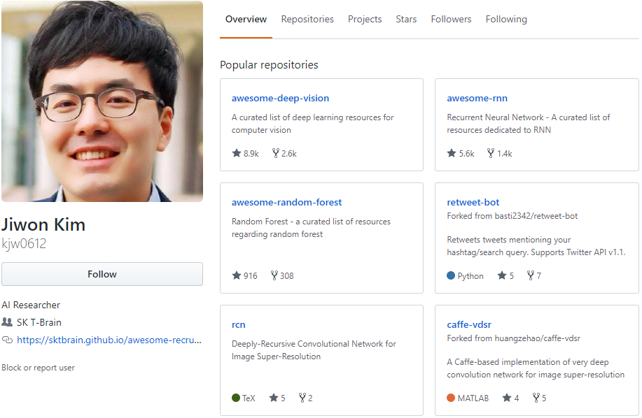
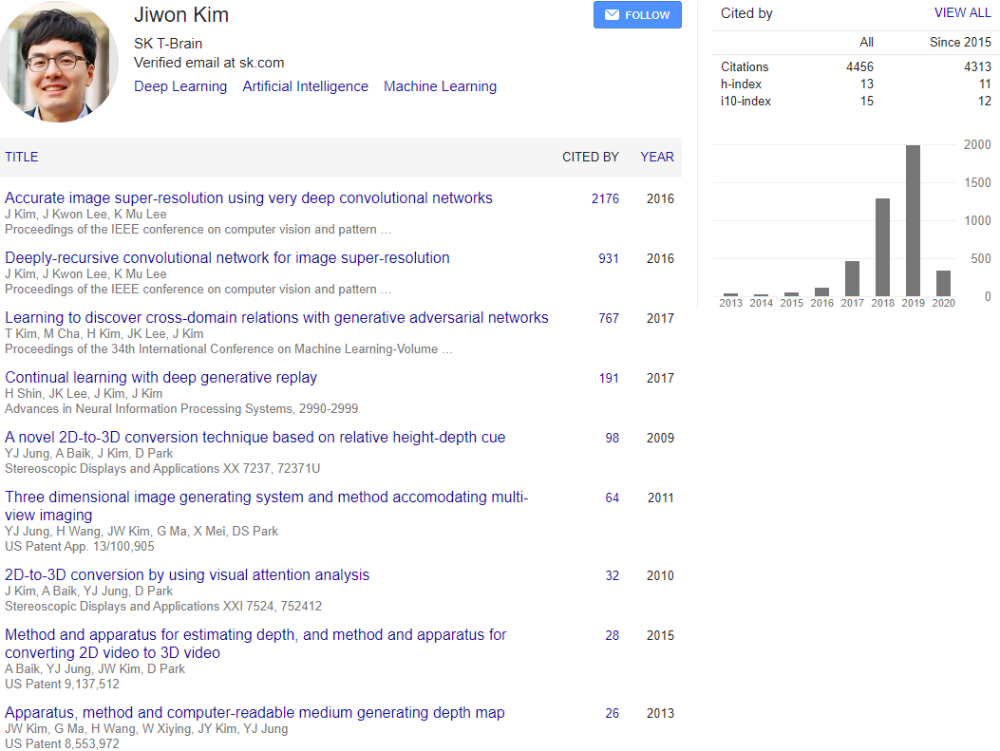

##### aimldl/documents/superstarts/industry/Jiwon_Kim.md

# SK텔레콤(T-브레인) 상무 김지원 (1985)

[T-브레인 김지원 상무... 인공지능 분야 유일하게 '국가과학기술자문회의' 자문위원 선임](http://www.aitimes.kr/news/articleView.html?idxno=15630)
> “국내 최고 AI전문가 중 한명이며, AI를 알리는 소통활동도 활발하다”며, 2016년말 SK그룹 임원 인사에서 상무에 선임돼 30대 그룹 내 30대 임원 중 최연소 임원이라는 기록을 세웠다. 그는 미국 MIT 공대에서 컴퓨터공학과 수학을 복수 전공했으며, 2007년 MIT 사상 처음으로 학부, 석사 과정을 만점으로 수석 졸업하고 삼성전자 종합기술원 전문연구원으로 근무했다. 현재, 그는 SK텔레콤의 AI 전담 연구 조직인 T-브레인에서 인공신경망(ANN, Artificial Neural Network) 등의 기술을 활용한 머신러닝, 강화학습 등의 AI 연구 개발을 주도하고 있다.

> 특히, T-Brain에서 개발한 코버트(KoBERT)는 기존 구글의 BERT의 한국어 성능 한계를 극복하기 위해 개발되었다. 위키피디아나 뉴스 등에서 수집한 수백만 개의 한국어 문장으로 이루어진 대규모말뭉치(corpus)를 학습하고 한국어의 불규칙한 언어 변화의 특성을 반영하기 위해 데이터 기반 토큰화(Tokenization) 기법을 적용해 기존 대비 27%의 토큰만으로 2.6% 이상의 성능을 향상시켜 새로운 언어이해 시대를 열고 있다. 또 코버트는 대량의 데이터를 빠른시간에 학습하기 위해 링 리듀스(ring-reduce) 기반 분산 학습 기술을 사용하여, 십억 개 이상의 문장을 다수의 머신에서 빠르게 학습하며, 파이토치(PyTorch), 텐서플루(TensorFlow), ONNX, MXNet 등 다양한 딥러닝 API를 지원함으로써, 많은 분야에서 언어 이해 서비스 확산에 기여할 것으로 예상된다. 현재 KoBERT는 깃허브(다운)에 오픈 소스로 공개되어 있으며, 많은 연구자 및 개발자들이 사용할 수 있도록 지속적으로 업데이트 되고있다.

https://github.com/kjw0612

[Google Scholar - Jiwon Kim](https://scholar.google.com/citations?user=xhvzHFAAAAAJ&hl=en)

