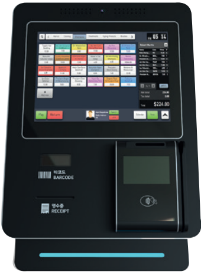
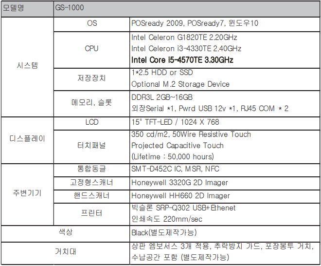

# Self-Check Out (SCO) / 무인 계산대 / 셀프 계산대

* 리테일 매장의 POS (Point of Sales, 판매시점 관리시스템) 중 한 형태
* 리테일 매장: 백화점, 대형 마트, 편의점, 면세점, 카페 등

* 상품인식, 카드결제, 간편결제 등의 기능을 제공

### GS ITM의 SCO GS-1000

* GS25, GS수퍼마켓에 공급되는 무인계산대
* SCO는 조금 다른 주변기기가 달려있는 컴퓨터와 같음.

* 참고 브로셔: [링크](http://www.gsitm.com/sites/default/files/news/SCO_2018.pdf), [SCO_2018.pdf](downloads/SCO_2018.pdf)

### 이마트 셀프 계산대, 신세계아이앤씨

[[생생I&C] 편한 결제 끝판왕~ 미래형 마트의 셀프결제(SCO) 체험기](https://m.post.naver.com/viewer/postView.nhn?volumeNo=17514855&memberNo=42472601)

[sco 셀프 결제]([https://www.google.com/search?q=sco+%EC%85%80%ED%94%84+%EA%B2%B0%EC%A0%9C&oq=sco+%EC%85%80%ED%94%84+%EA%B2%B0%EC%A0%9C&aqs=chrome..69i57.4950j0j7&client=ubuntu&sourceid=chrome&ie=UTF-8](https://www.google.com/search?q=sco+셀프+결제&oq=sco+셀프+결제&aqs=chrome..69i57.4950j0j7&client=ubuntu&sourceid=chrome&ie=UTF-8))

[국내 최초 자동결제 셀프(Self)매장 문 연다...리테일테크 집약](http://www.hellot.net/new_hellot/magazine/magazine_read.html?code=202&idx=48171&public_date=2019-10), 2019.10.14 

* 셀프매장: 쇼핑 후 매장을 나가면 자동 결제되는 미래형 유통 매장
  * 상품 바코드 스캔, 결제 등의 과정이 전혀 없음
* 신세계아이앤씨 (기술개발) + 이마트24 (상품 공급 및 매장 운영)
  * 컴퓨터 비전, 딥러닝기반 AI, SSG페이, 클라우드 기반 POS

* 입장 QR코드를 스캔
  * SSG페이 또는 이마트24 앱(APP)을 통해 발급
  * 쇼핑
  * 매장 나감