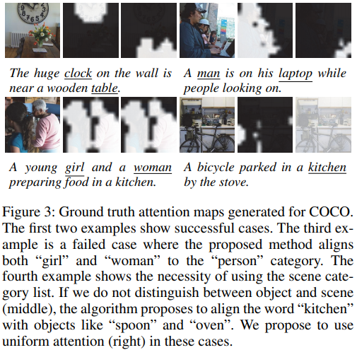

Attention Correctness in Neural Image Captioning.md

### Attention Correctness in Neural Image Captioning
Chenxi Liu, Junhua Mao, Fei Sha, Alan Yuille
Thirty-First AAAI Conference on Artificial Intelligence
Last modified: 2017-02-12
https://www.aaai.org/ocs/index.php/AAAI/AAAI17/paper/view/14246/14297
#### Abstract
Attention mechanisms have recently been introduced in deep learning for various tasks in natural language processing and computer vision. But despite their popularity, the ``correctness'' of the implicitly-learned attention maps has only been assessed qualitatively by visualization of several examples. In this paper we focus on evaluating and improving the correctness of attention in neural image captioning models. Specifically, we propose a quantitative evaluation metric for the consistency between the generated attention maps and human annotations, using recently released datasets with alignment between regions in images and entities in captions. We then propose novel models with different levels of explicit supervision for learning attention maps during training. The supervision can be strong when alignment between regions and caption entities are available, or weak when only object segments and categories are provided. We show on the popular Flickr30k and COCO datasets that introducing supervision of attention maps during training solidly improves both attention correctness and caption quality, showing the promise of making machine perception more human-like.

