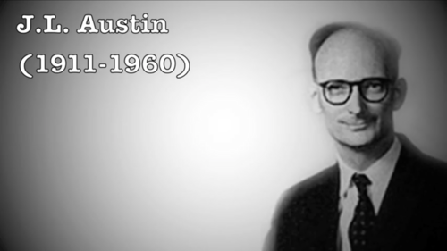
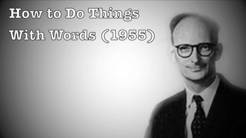
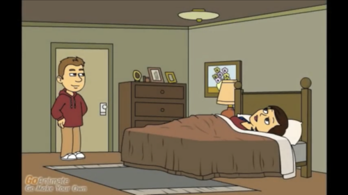
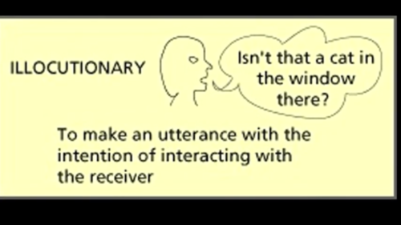
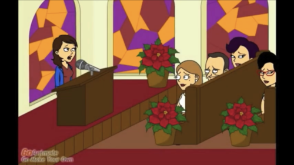
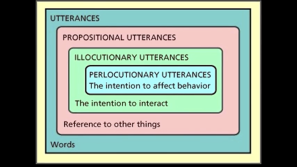
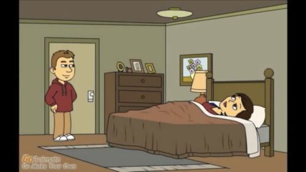
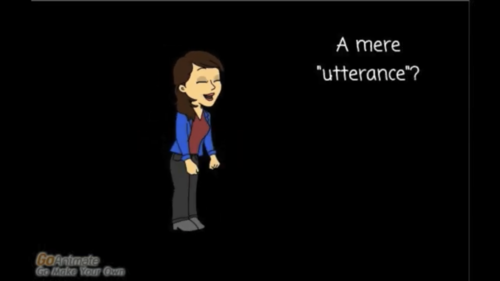
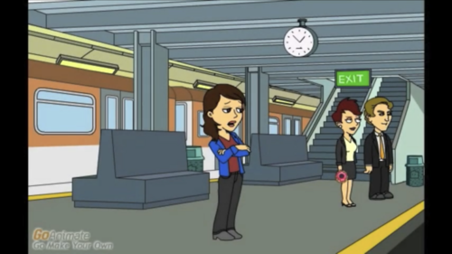
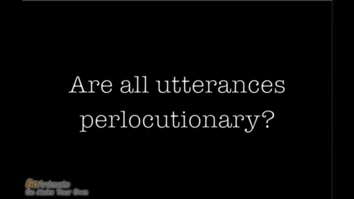

1-A_Speech-Act_Theory_Adventure.md
* Draft: 2019-12-12 (Thu)

## Speech Act Theory
[A Speech-Act Theory Adventure](https://youtu.be/32Lkl7oUJrQ) is a Youtube video by
Jenny Bledsoe. This is an excellent introduction to the speech act theory with concrete and fun examples. The difficult concept and terminologies are explained easily with cartoon. I like it! Note propositional utterance = locutionary utterance.

The screen capture from the video with summary is below. Watch the [full video](https://youtu.be/32Lkl7oUJrQ) for details.

