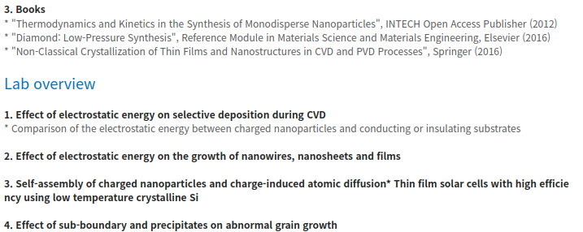

##### aimldl/documents/zzz/inspiration/02-Nong-moon_Hwang.md

## Prof. Nong-Moon Hwang

### Prof. Hwang
Naver Search: 서울대 황농문 교수
* [황농문 | SNU 서울대학교 공과대학](https://eng.snu.ac.kr/node/8186)

* [TFMLab](http://tfml.snu.ac.kr/)

  * [Professor 황농문 교수님 소개](http://tfml.snu.ac.kr/board/bbs/board.php?bo_table=b1&wr_id=1)

### Mass Media
[이현덕이 만난 생각의 리더(128) '몰입 전문가' 황농문 서울대 교수](https://iton.tistory.com/2250)
