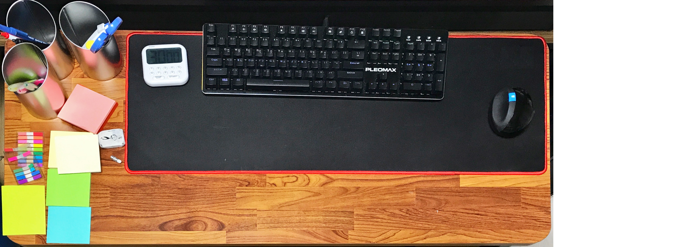
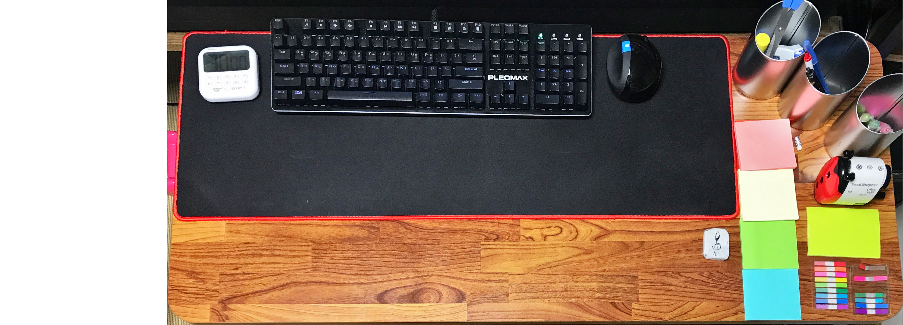

* Draft: 2020-05-23 (Sat)

# Home Office의 책상

## Before
자주 쓰는 필기구를 종류별로 통에 넣고, 색깔별 포스트잇을 순서대로 놓았습니다. 물론 포스트잇의 열려있는 방향은 4개 모두 동일합니다. 그래야 어느쪽부터 열지 고민하지 않고 기계적으로 열 수 있기 때문이죠. 읽을 때 넘어갈 때 쓰기 위한 tag도 있구요.

## After
책상 위에서 실제로 쓸 때 포스트잇을 오른쪽에 두고 쓴다는 것을 깨달았습니다. 쓸 때는 오른쪽에 한 두개 놔두고 쓰다가, 다 쓰고 나면 왼쪽 편에 정리를 하는... 그래서 필기구를 오른쪽으로 옮겨버렸습니다. 훨씬 빨라지고 기계적으로 쓸 수 있었습니다.

