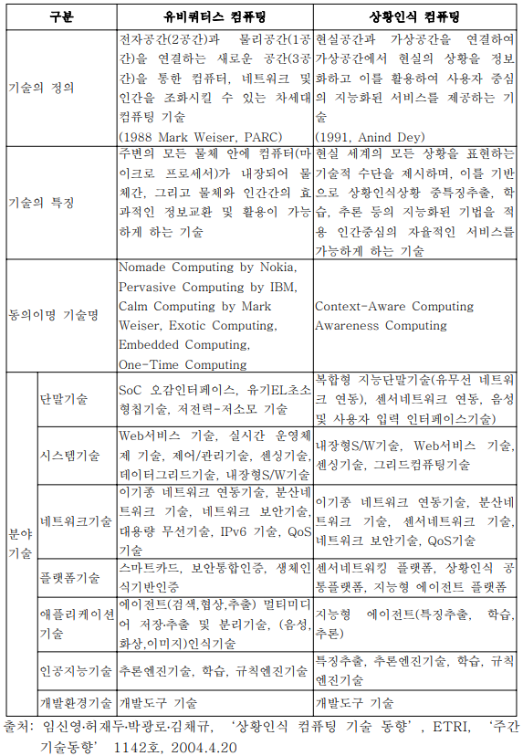
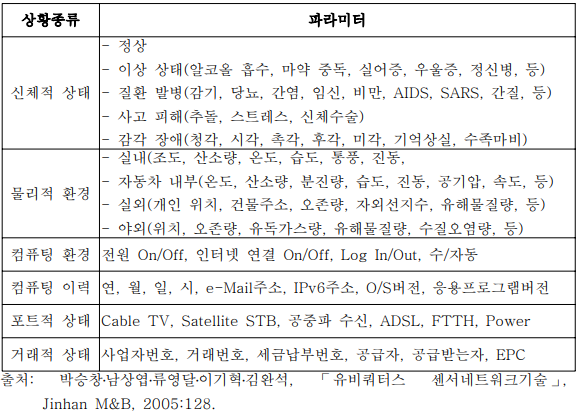

surveys/로봇_상황_인지.md

[Google search: 로봇 상황 인지](https://www.google.com/search?q=%EB%A1%9C%EB%B4%87+%EC%83%81%ED%99%A9+%EC%9D%B8%EC%A7%80&oq=%EB%A1%9C%EB%B4%87+%EC%83%81%ED%99%A9+%EC%9D%B8%EC%A7%80&aqs=chrome..69i57.2684j0j1&client=ubuntu&sourceid=chrome&ie=UTF-8)

### "상황 인지"의 영어 표현 및 동의어
Q: 관련 논문을 검색함에 있어서 "상황 인지"라는 용어가 무엇인가?
A: Context aware, situational aware, multi-modal


Ubiquitous Computing -> Context Aware Computing/Awareness Computing


* [지능형 로봇](https://ko.wikipedia.org/wiki/지능형_로봇)
* 지능형 로봇(Intelligent Robots)은 외부환경을 인식(Perception)하고, 스스로 상황을 판단(Cognition)하여, 자율적으로 동작(Manipulation)하는 로봇을 의미한다. 기존의 로봇과 차별화되는 것은 상황판단 기능과 자율동작 기능이 추가 된 것이다. 상황판단 기능은 다시 환경인식 기능과 위치인식 기능으로 나뉘고. 자율동작 기능은 조작제어 기능과 자율이동 기능으로 나눌 수 있다. 따라서 이 4가지 기능을 가능하게 하는 기술을 지능형로봇의 4대 중점 돌파기술이라 한다.
-> 상황판단 기능 = 환경인식 기능 + 위치 인식 기능
=> 위치 인식 기능은 우리의 역할이 아니므로, 환경인식 기능을 구현.

* 물체인식 기술
물체인식(物體認識)은 지능형 로봇의 4대 중점기술 중 하나로서, 미리 학습을 한 지식정보를 바탕으로, 물체의 영상을 보고, 물체의 종류, 크기, 방향 위치 등 3차원적 공간정보를 실시간으로 알아내는 기술이다. 앞의 2개의 기술과 달리, 로봇분야 뿐만 아니라 컴퓨터과학 분야 전체의 도전과제이다. 인공지능의 비밀이 풀려야 될 정도로 매우 어려운 기술이다. 현재는 미국의 ER사가 가장 앞선, 물체인식 SW를 상품화하였으나, 그 인식률은 아직 50(유아수준의 인식 지수)정도의 수준에 머무는 것으로 판단된다. 로봇분야에서는 이동중 인식기능 등에 특화하여, 집안에서 특정물건을 구분해내어, 주인에게 배달하는 심부름 로봇등에 적용하는 것이 필요하다.

인간과 같이 두눈을 가지고 사물을 판별하는 기술은 앞으로 10년 이후에도 완벽히 재현하기 어려운 고난이도의 기술이다. 따라서 제품형 로봇에 맞는 물체인식은 카메라가 아닌 레이저 공간센서와 같은 측정기술을 삼차원으로 적용하는 형태가 될 것이다. 즉 바닥을 스캔하여, 이물질을 판단하며, 간단한 3차원 모델로 물체의 종류를 판단한다.

* 위치인식 기술
위치인식은 지능형 로봇의 4대 중점기술 중 하나로서, 기계가 스스로 공간지각능력을 갖는 기술이다. 인공지능적 기술이 기반이 된다. 물체인식과 더불어 2대 인지기술로서, 로봇의 자율이동 기능구현에 핵심이 되는 기술이다. 센서기반, 마크기반, 스테레오 비전 기반 위치인식기술 등 다양한 접근법이 연구되고 있으나, 현재 상용화되고 있는 기술은 마크기반 정도이다. 삼성의 청소로봇 하우젠[깨진 링크(과거 내용 찾기)]이 천정의 윤곽을 보고 위치를 인식하는 것으로 알려지고 있다. 청소로봇, 가사로봇 등 가정용로봇이 상용화되기 위해 가장 먼저 풀어야 기술이다. 이 역시 위치인식률은 50정도의 수준으로 앞으로 많은 연구가 필요한 분야이다.

임의의 공간에서 위치를 판별하는 기능 또한 현재로선 인공지능이라는 지식핸들링기술의 비밀이 벗겨지지 않는 당장 실현될 것으로 보이지 않는다. 제품형 로봇에서는 RF기반 위치센서 등이 실내 GPS역할을 하며 위치를 판별할 수 있을 것으로 보인다.

응용분야
과거의 로봇은 주로 산업용으로 주로 사용되었으나, IT기술과 인공지능, 센서 및 Actuator기술 등의 발달로, 그 범위는 가정, 복지, 교육, 오락, 의료, 국방, 사회안전, 해양, 환경 등 점차 그 범위가 더욱 확대 될 것이다.

가사지원/실버 로봇
가사지원 로봇은 청소로봇에서 심부름로봇에 이르기까지 집안일을 도맡아 하는 로봇이다. 현재의 잘 정돈된 바닥만 청소하는 진공청소 로봇이 보다 진화하여, 3차원 센서를 가지고 바닥에 떨어진 옷가지들을 구분해 내고, 머니퓰레이터가 장착된 청소로봇은 어지럽혀진 물건들을 정리하는 정리정돈 로봇이 개발될 예정이다. 보다 인지기능이 발달하면, 주인을 알아보고, 물컵등을 배달하는 심부름로봇에서, 설거지, 밥상차리기 등을 보조하는 가사지원 로봇이 일반 가정에 보급되는 그날, 가사지원 로봇은 가전사업의 꽃으로 거대한 산업으로 형성될 전망이다.

실버로봇은 독거노인을 보조하는 로봇이다. 스스로 거동이 불편한 노인을 위해, 옷갈아 입히기, 배변보조, 부축하며 같이 움직이기 등 현재의 간병사들이 하는 환자보조 업무를 수행할 수 있다. 인간의 제스처 인식이나, 얼굴표정 인식을 갖추어 주인의 의도와 상태를 인식할 수 있다. 인간의 몸과 같은 생체를 안전하게 핸들링하기 위해, 인공피부와 촉각센서등을 갖추고 있다. 인간의 몸을 부축하기 위해, 텐더블 머니퓰레이션 기능이 구현되며, 인공근육과 같은 보다 효율적이고 강력한 힘을 내는 액츄에이터도 필요할 것으로 예상된다.분명 말했지만 예상되는 것이다!!!! 근력 증강 및 보행보조, 무거운 물건 들기 등을 가능하게 하는 웨어러블 로봇도 실버로봇의 한 형태가 될 것으로 예측된다.

교육/오락 로봇
로봇만큼 어린이들에게 인기있는 장난감과 애니메이션이 없다. 이를 활용한 교육효과는 어린이 두뇌형성에 매우 큰 것으로 알려지고 있다. 지금도 로봇올림피아드 등 교육로봇 경진대회에 해마다 2만명 이상의 학생이 참가하는 등 교육용로봇 시장은 이미 형성되어 있다. 보다 교육컨텐츠와 연결되어, 지능형로봇이 보급된다면, 지능형로봇이 교육산업의 핵심으로 막대한 시장창출을 할 것으로 전망된다.

의료/헬스케어 로봇
수술로봇, 재활로봇, 간호/간병로봇, 진단로봇, 병원 물류 로봇 등 다양한 의료로봇이 현실화 되어, 의료로봇산업이 거대 산업으로 발전될 전망이다. 이미 수술로봇에는 미국 인튜이티브 서지컬사의 복강경 수술로봇인 다빈치시스템이 독점적 위치를 점하고 있으며, 이밖에도 마코서지컬사의 관절수술로봇, 마조로보틱스의 척추수술로봇이 병원에서 활약하고 있다. 재활분야에서는 바이닉스사의 의족로봇 등이 상용화 되었으며, 인공지능기술의 발달로 다양한 의료데이터와 결합하여 보다 정밀하고 비침습적인 로봇들이 등장할 것으로 기대된다. 노령화시대를 맞아 노인들의 건강을 돌보는 헬스케어 로봇도 현실화되어 지능형로봇이의료산업의 핵심으로 막대한 시장창출을 할 것으로 전망된다.

국방/안전 로봇
지금도 각종 테러나 범죄에서 군사용로봇의 활약상은 매우 두드러진다. 이라크에 파병되어, 작전을 돕는 폭탄제거로봇에서 재난현장에서 사람을 구출하는 안전로봇, 현재의 감시카메라(CCD)가 진화하여, 범죄예방을 위해 순찰하는 감시순찰 로봇에 이르기까지, 로봇기술에 의해, 사회가 지켜지는 시대가 열릴 것이다. 인공지능을 기반으로 한 범죄 사전 예방, IT네트워크와 연동되는 범인 추적기능까지 갖게 되면, 안전로봇은 국방산업 및 보안산업의 꽃으로 거대 산업을 형성할 것으로 전망된다.

해양/환경 로봇
해양/환경로봇은 극한로봇의 일종이다. 현재의 화석에너지를 대체하는 해양에너지분야, 식량부족을 해결할 해양자원을 탐사하는 로봇이 새로운 해양산업으로 등장할 것이다. 인간이 갈 수 없는 심해를 탐사하며, 자원과 에너지를 개발하는 기술에서 해양로봇을 활용한 기술이 꼭 필요할 것으로 기대된다. 또한 환경오염을 감시하고, 오염을 정화시키는 환경미화 로봇도 등장할 전망이다.

-> 이 중 어느 쪽에 포커스를 맞출 지 정해야 한다.

* [상황인식 컴퓨팅의 현황과 전망](https://www.itfind.or.kr/UWZIN/file63427-상황인식%20컴퓨팅의%20현황과%20전망.pdf), NIA, 류영달, 2008.5

  * 표 1. 유비쿼터스 컴퓨팅 vs 상황인식 컴퓨팅


  * 1. 상황인식 컴퓨팅 개념 > 상황과 상황정보의 정의
  * 상황감지시스템(Context-Sensitive System)
  * 상황기반검색 (Contextual Search)
  * 다중상황변환(Multitasking Context Switch),
  * 심리적 상황 인지 (Psychological Contextual Perception)
상황은 Context로 번역된다.

상황에 대한 대표적인 정의는 Dey와 Abowd의 논문(1999)에서 제시됨
 “상황은 객체의 상태를 규정할 수 있는 어떤 정보도 포함한다. 객체는 사용자와 어플리케이션, 그리고 그 사이의 상호 작용과 관련되어 고려해야 할 사람, 장소, 사물을 가리킨다.”1)

 이것은 상황에 관련된 객체를 정의하고 여기에서 발생하는 모든 정보를 상황 정보로 이해
 - 상황은 정의되는 방식에 따라 그 범주와 분류가 달라질 수 있지만 사실 상 거의 모든 정보는 ‘상황정보’로 분류될 수 있음
 - 따라서 특정 상황에 관련된 객체가 지정되면 상황정보를 추출 가능

*** 상황을 인지하기 전에 객체를 정의하는 것에서 시작해야 한다.

상황정보의 가장 중요한 성격으로 다음 4개의 카테고리로 구분2)
 1) Identity : 객체에 식별자를 부여
 2) Location : 2차원에서의 위치 정보 및 방향과 고도, 객체간 위치 관계, 내용물을 포함
 3) Status (or Activity) : 객체가 가지고 있는 고유의 특성 중 센싱이 가능한 부분
 4) Time : 역사적 정보의 가치를 높이는 것으로 대부분의 경우 다른 상황과 접합하거나
           기간을 인식하는 데 사용되며, 어떤 경우에는 순서의 나열이나 인과 관계를 확인하는 것만으로도 의미가 있음

Object detection -> Object ID tracking
Object 중 사람이 있을 경우, 해당 Object를 잘라내서
T1: 내가 아는 주요 인물과 일치하는가? e.g. 회장님
-> action1 or a1: CEO를 정면으로 향한다.
=> a2: [제어] 인사를 한다. [발화] " 회장님이시죠?"
   If yes, (데모를 위해선 yes/no를 수동/원격으로 정한다.)
   처음일 경우에 "처음 뵙겠습니다. 저는 누구 입니다."
   여러번 봤을 경우에 "회장님, 오늘 여러번 뵙네요."
   If no, [발화]

```
   서비스 파라미터
   o 상황인식 컴퓨팅이란 "사용자의 업무와 관련 있는 적절한 정보, 지식, 통
   화, 또는 콘텐츠 서비스를 사용자에게 제공하는 공정에서 특정 사용자의 '
   특정 상황'을 감지하고 인식한 다음 그의 요구대로 정보와 호출을 처리하
   고 나서 즉시 그의 단말기를 통해 표현해 주는 컴퓨팅".
   o 개인이 가정이나 사무실이나 학교에서 사용 중인 오늘날과 같은 인터넷
   기반의 집중된 컴퓨팅 환경에서
    - 특정 사용자마다 100% 만족할 수 있도록 언제, 어디서, 누구나, 어느
   기기, 어느 형식으로든 융합/복합/결합 형태의 'TIBIC '서비스를 제공
    ※ TIBIC = Telecommunication+Information+Broadcasting+Internet+Commerce
    - 특정 개인의 상황정보를 정확하게 추출하기 위해서는 <표 2>와 같은 파
   라미터들을 주어진 해상도와 공차범위 내에서 감지하는 Chip 필요
```

표2. 유비티즌의 상황인식 파라미터

스마트 하다고 느끼려면 중요해보인는 요소
* 과거의 이력을 잘 기억해두기
* 같은 내용 반복하지 않기. 예: 안녕하세요, 처음 뵙겠습니다... 를 자꾸 반복하면 멍청해보임.
*

표3. 가정 공간의 상황인식 파라미터

-> 이 상황 중 해당 로봇의 하드웨어로 구현 가능한 상황을 좁힌다.
=> 가능한 시나리오를 몇 개 짠다.
-=> 시나리오를 수행할만한 구체적인 구현방안을 마련한다.
==> 구체적인 블록도를 그린다.

시나리오: 연기가 자욱하게 한다.
[발화] 연기가 자욱하네요. Evacuation route로 안내해드릴까요?
If yes, -> 비상등 + 작은 siren소리를 내며 [발화] 출구로 안내합니다. 저를 따라오십시요.
[이동]

### 상황의 인식
o 상황인식컴퓨팅은 사용자의 위치 부근의 사용자와 사물에 적응하는 소프트웨어
 - 상황인식을 최초로 언급한 Schilit와 Theimer(1994)의 정의4)
 - 이런 능력을 가진 시스템은 컴퓨팅 환경을 테스트하고 환경의 변화에 반응할 수 있을 것
 - 이후 상황인식컴퓨팅은 여러 연구에서 다른 용어로 불리면서 발전됨
 ※ 어떤 분야에서는 Context Awareness보다 Situational Awareness가 더 일반적으로
사용되는데, 심리학 등 사람을 연구하는 분야에서 사람의 상황 인식력을 표현함

4) Bill Schilit & M. Theimer, 1994. IEEE Network 8(5), 'Disseminating active map information to mobile hosts'.
#### 능동적 vs 수동적 상황인식
• 능동적 상황인식 (Active Context Awareness) : 새로운 상황이나 상황
의 변경이 발생하면 자동으로 이와 관련된 동작을 실행하도록 구성
• 수동적 상황인식 (Passive Context Awareness) : 새로운 상황이나 상황
의 변경이 발생하면 사용자에게 이에 대한 정보를 제공하거나 차후 검색
이 가능하도록 정보를 유지
-> Too nosy할 수 있으므로 수동을 우선 시 하고, 정말 특수한 상황에서 능동적인 반응을 하도록 아주 조금만 넣는 시나리오를 짜야한다.
=> 스타워즈의 Droids를 참고해야 한다.
C-3PO보다는 R2-D2에 가까운 시나리오를 짜야함.

source: https://starwars.fandom.com/wiki/Droid/Legends
