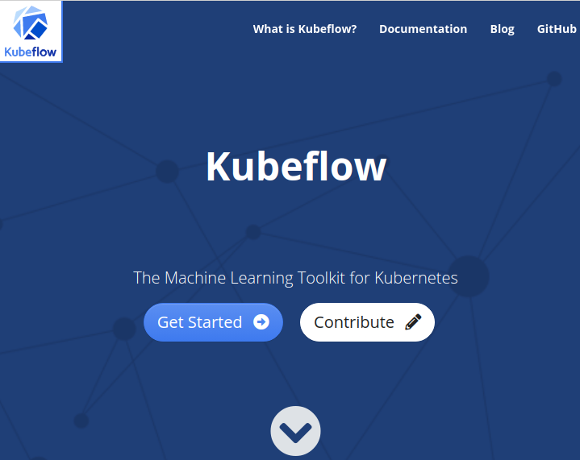
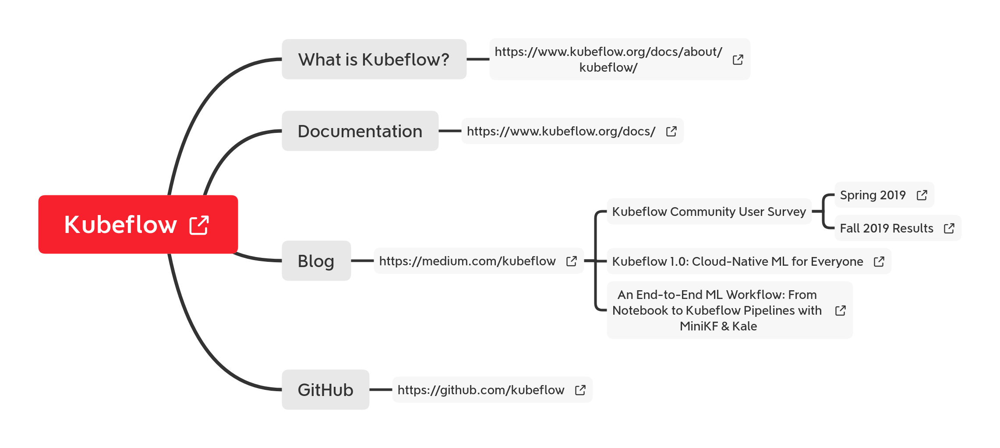
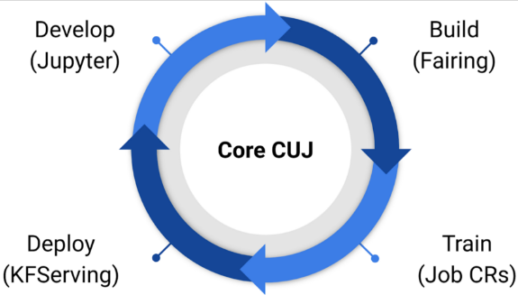

##### continuous_integration/kubeflow.md

* Draft: 2020-03-09 (Mon)

# Kubeflow

Kubeflow, the Machine Learning Toolkit for Kubernetes,  is a continuous integration tool for machine learning pipelines that orchestrates an [end-to-end machien learning stack](https://www.slideshare.net/jwiegelmann/endtoend-machine-learning-stack) built on Kubernetes. The Kubeflow project is based on Google's internal method to deploy TensorFlow models to Kubernetes called TensorFlow Extended.

An example of the complicated workflows running on Kubernetes is to do data processing,  train a model with [TensorFlow](https://en.wikipedia.org/wiki/TensorFlow) or [PyTorch](https://en.wikipedia.org/wiki/PyTorch) , and deploy the model to [TensorFlow Serving](https://en.wikipedia.org/w/index.php?title=TensorFlow_Serving&action=edit&redlink=1). 

Kubeflow is designed to run everywhere Kubernetes runs. Examples include on-premise, [AWS](https://en.wikipedia.org/wiki/Amazon_Web_Services), [GCP](https://en.wikipedia.org/wiki/Google_Cloud_Platform), [Azure](https://en.wikipedia.org/wiki/Azure_DevOps_Server), and so on.

## Overview of an End-to-End Machine Learning Stack (E2E ML Stack)

> Data scientists and engineers are now able to develop a complete pipeline composed of segmented steps. These segmented steps in Kubeflow are loosely coupled components of an ML pipeline, a feature not core to other frameworks, allowing pipelines to become easily reusable and modifiable for other jobs. This added flexibility has the potential to save an incalculable amount of labor necessary to develop a new data pipeline for each specific use case. Through this process, Kubeflow aims to simplify Kubernetes deployments while also accounting for future needs of portability and scalability. - [Kubeflow, Wikipedia](https://en.wikipedia.org/wiki/Kubeflow)

## [https://kubeflow.org](https://kubeflow.org/)

### Kubeflow 1.0 (Released on Dec. 2017)

Roughly speaking, the machine learning work flow is to develop, build, train, and deploy a machine learning model. This work flow is done end-to-end by Kubeflow which can be considered as Continuous Integration of Machine Learning (CIoML). Kubeflow provides tools to develop, build, train, and deploy a machine learning (ML) model. 

* Jupyter to develop a model.
* [Fairing](https://www.kubeflow.org/docs/fairing/) to create streamlines of build-train-deploy chain.

Jupyter includes  Jupyter Hub (repository). is a popular open-source web application to create and share documents. 

Kubeflow Fairing is a Python package that streamlines the process of building, training, and deploying machine learning models in a hybrid cloud environment.

build containers and create Kubernetes resources to train their models

* [KFServing](https://github.com/kubeflow/kfserving)  to create and deploy a server for inference)

Job CRs (to train a model)

- Kubeflow’s UI, the [central dashboard](https://www.kubeflow.org/docs/components/central-dash/overview/)

Other notable keywords on the homepage include:

- [Jupyter notebook controller](https://github.com/kubeflow/kubeflow/tree/master/components/notebook-controller) and [web app](https://www.kubeflow.org/docs/notebooks/why-use-jupyter-notebook/)
- [Tensorflow Operator](https://www.kubeflow.org/docs/components/training/tftraining/) (TFJob) and [PyTorch Operator](https://www.kubeflow.org/docs/components/training/pytorch/) for distributed training
- [kfctl](https://www.kubeflow.org/docs/other-guides/kustomize/) for deployment and upgrades
- [Profile controller](https://github.com/kubeflow/kubeflow/tree/master/components/profile-controller) and UI for multiuser management

#### 

* 

For details, refer to [Kubeflow 1.0: Cloud-Native ML for Everyone](https://medium.com/kubeflow/kubeflow-1-0-cloud-native-ml-for-everyone-a3950202751).

Multi-framework

https://github.com/kubeflow

### 

#### Getting Started with ML on Kubernetes

Deploying Kubernetes optimized for ML and integrated with your cloud is no easy task. With 1.0 we are providing a CLI and configuration files so you can deploy Kubeflow with one command.

* kfctl apply -f kfctl_gcp_iap.v1.0.0.yaml
* kfctl apply -f kfctl_k8s_istio.v1.0.0.yaml
* kfctl apply -f kfctl_aws_cognito.v1.0.0.yaml
* kfctl apply -f kfctl_ibm.v1.0.0.yaml
