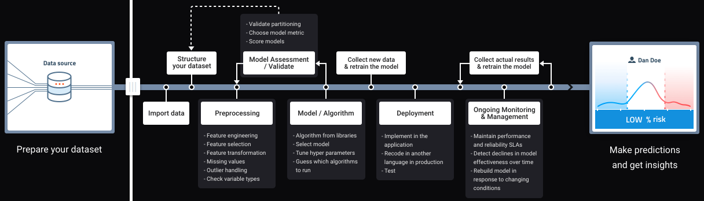
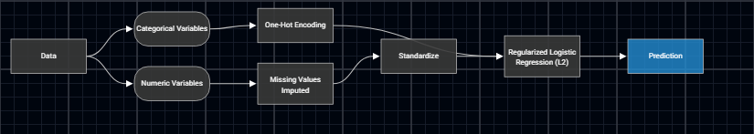
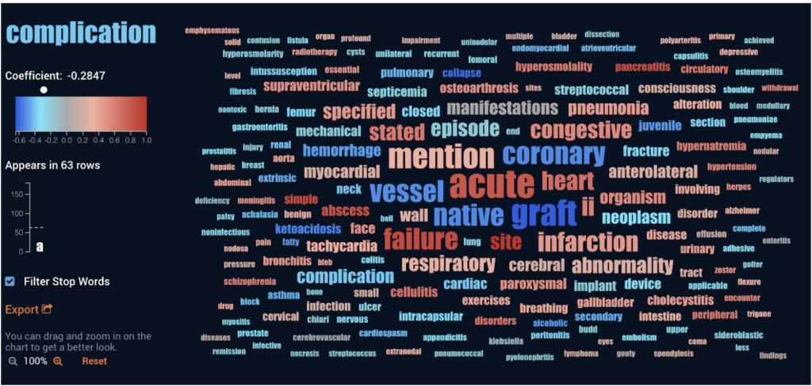
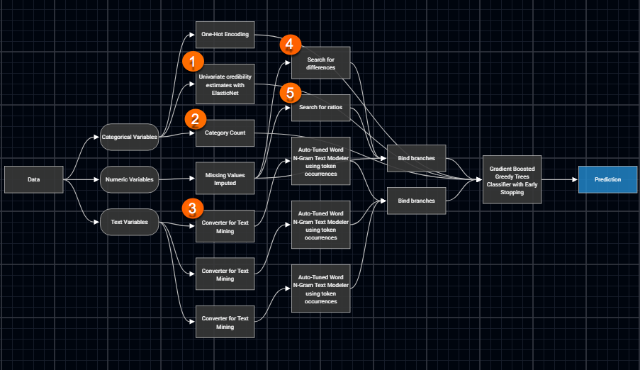
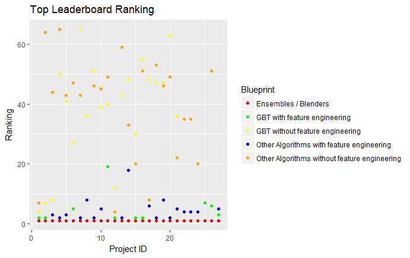
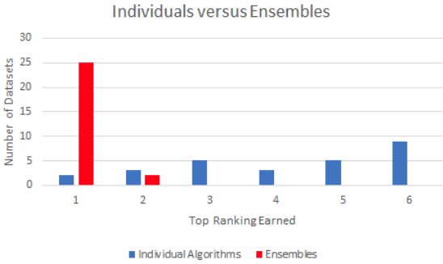
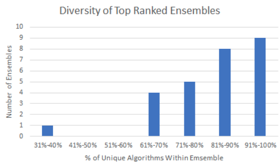

# [What is Automated Machine Learning?](https://www.datarobot.com/platform/what-is-automated-machine-learning/)

## How DataRobot Delivers Enterprise AI

#### Old way

#### With DataRobot

## The 10 Steps of Automated Machine Learning

### Step 1: Preparing Data

Every [machine learning algorithm](https://www.datarobot.com/wiki/algorithm/?cta_id=web-machine-learning-algorithm&cta_position=ten-steps-call-out) works differently and has different data requirements. For example, some algorithms need numeric features to be normalized, and some do not. DataRobot transforms raw data into the specific format that each algorithm needs for optimal performance then follows best practices for data partitioning. 

[Machine Learning Algorithms](https://www.datarobot.com/wiki/algorithm/?cta_id=web-machine-learning-algorithm&cta_position=ten-steps-call-out) [Machine Learning Model](https://www.datarobot.com/wiki/model/) 

[Model blueprints](https://www.datarobot.com/wiki/model-blueprint/?cta_id=web-model-blueprint&cta_position=ten-steps-call-out) are the combinations of:

* feature engineering 
* other data preprocessing steps 
* machine learning algorithms

[Data Insights](https://www.datarobot.com/wiki/insights/)

[Prediction](https://www.datarobot.com/wiki/prediction/)

### Step 2: Feature Engineering

[Feature engineering](https://blog.datarobot.com/automated-feature-engineering/?cta_id=web-automated-feature-engineering-blog&cta_position=ten-steps-call-out) is the process of modifying data to help machine learning algorithms work better, and is often time-consuming and expensive. DataRobot engineers new features from existing numeric, categorical, and text features. It knows which algorithms benefit from extra feature engineering and which don’t, and only generates features that make sense given the data characteristics.

[Automated Feature Engineering](https://blog.datarobot.com/automated-feature-engineering?cta_id=web-automated-feature-engineering-blog&cta_position=ten-steps-call-out)

### Step 3: Diverse Algorithms

Every dataset contains unique information that reflects the individual characteristics of a business. Due to the variety of situations and conditions, [one algorithm cannot successfully solve every possible business problem or dataset.](https://blog.datarobot.com/successful-ai-comes-from-diversity-and-teamwork/?cta_id=web-ais-are-individuals;cta_position=ten-steps-call-out) With DataRobot you get immediate access to hundreds of diverse algorithms, and the appropriate pre-processing, to test against your data in order to find the best one for your particular AI challenge.

[Successful AI Comes From Diversity and Teamwork](https://blog.datarobot.com/successful-ai-comes-from-diversity-and-teamwork?cta_id=web-ais-are-individuals;cta_position=ten-steps-call-out)

AIs are Individuals, Just Like People

AIs Can Be Formed Into Teams, Just Like People

Benchmarking AI Diversity vs. Accuracy

More than half of the algorithms that were able to rank first on a dataset were not the most accurate for any other dataset!

The best ranking a deep learning algorithm earned was 7th place. Now, this does not mean that deep learning is worthless, but rather that it tends to perform best on specialist data types such as images.

Ensembles were almost always more accurate than individual algorithms, and when they weren’t in first place, they came second by only the slightest of margins.

Most commonly, the top ranked ensembles were composed of unique algorithms. For each row of data, any particular algorithm may be the most accurate algorithm. Allocating optimal voting powers to each algorithm ensures that if one algorithm gets a particular row wrong, the other algorithms can balance it out, improving accuracy.

Why Creating AI Diversity Is Difficult

Why Creating AI Diversity Is Easy

### Step 4: Algorithm Selection

Having hundreds of algorithms at your fingertips is great, but in many cases users don’t have time to try each and every algorithm on their data. Some algorithms aren’t suited to the data, some are not suited to the data sizes, and some are extremely unlikely to work well on the data. DataRobot will only run the algorithms that make sense for your data.

[Can An AI Recommend the Best Algorithm for Me?](https://blog.datarobot.com/can-an-ai-recommend-the-best-algorithm-for-me?cta_id=web-can-an-ai-recommend-the-best-algorithm-for-me&cta_position=ten-steps-call-out)

### Step 5: Training and Tuning

It’s standard for machine learning software to train the model on your data. DataRobot takes this a step further by using smart hyperparameter [tuning](https://www.datarobot.com/wiki/tuning/?cta_id=web-model-tuning&cta_position=ten-steps-call-out), not just brute force, to tune the most important hyperparameters for each algorithm. The platform knows which features to include and which to leave out, and which feature selection method works best for different algorithms.

### Step 6: Ensembling

In data science jargon, teams of algorithms voting together on an estimated outcome are called “ensembles” or “blenders.” Each algorithm’s strengths balance out the weaknesses of another. Ensemble models [typically outperform individual algorithms](https://blog.datarobot.com/successful-ai-comes-from-diversity-and-teamwork/?cta_id=web-esembling;cta_position=ten-steps-call-out) because of their diversity. DataRobot finds the optimal algorithms to blend together and tunes the weighting of the algorithms within each blender model.

### Step 7: Head-to-Head Model Competitions

You won’t know in advance which algorithm will perform the best, so you need to compare the [accuracy](https://www.datarobot.com/wiki/accuracy/?cta_id=web-accuracy;cta_position=ten-steps-call-out) and speed of different algorithms on your data regardless of which programming language or machine learning library they came from. You can think of it as a competition amongst the models where the best model wins! DataRobot builds and [trains](https://www.datarobot.com/wiki/training-validation-holdout/?cta_id=web-training-validation;cta_position=ten-steps-call-out) dozens of models, compares the results, and ranks the models by accuracy, speed, and the most efficient combination of the two.

### Step 8: Human-Friendly Insights

Over the past few years, machine learning and AI have made massive strides in predictive power, but at the price of complexity. It is not enough for a model to score well on accuracy and speed – you also have to [trust the answers](https://blog.datarobot.com/give-me-one-good-reason-to-trust-artificial-intelligence/?cta_id=web-trust-the-answers;cta_position=ten-steps-call-out) it is giving. And in regulated industries, you must justify the model to a regulator. DataRobot explains model decisions in a human-interpretable manner, showing which features have the greatest impact on the accuracy of each model and the patterns fitted for each feature. DataRobot can also provide prediction explanations to illustrate the key reasons why a specific prediction was made.

### Step 9: Easy Deployment

A [recent Harvard Business Review article](https://hbr.org/2017/06/3-things-are-holding-back-your-analytics-and-technology-isnt-one-of-them) described a team of analysts that built an impressive predictive model, but the business lacked the infrastructure needed to directly implement the trained model in a production setting, which was a waste of time and resources. All DataRobot models are production-ready, and can be [deployed](https://www.datarobot.com/wiki/machine-learning-model-deployment/?cta_id=web-deployed;cta_position=ten-steps-call-out) in several ways on standard system hardware.

### Step 10: Model Monitoring and Management

In a constantly changing world, your AI applications need to keep up to date with the latest trends. DataRobot makes it easy to compare predictions to actual results and to train a new [model](https://www.datarobot.com/wiki/model/) on the latest data. DataRobot also proactively identifies when a model’s performance is deteriorating over time.