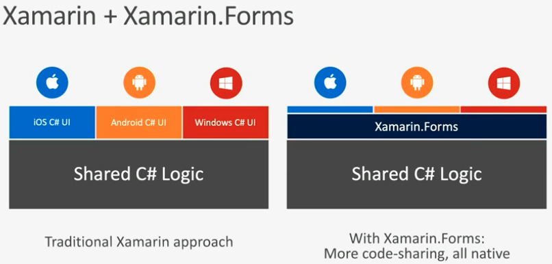

# mobile cross platform framework

### 크로스 플랫폼 프레임워크와 툴

어떤 프로그래밍 언어로 애플리케이션을 만들 것인가? 크로스 플랫폼 솔루션 대부분은 하나의 프로그래밍 언어만 지원한다. 프레임워크, 모바일 개발에 프로그래밍 언어까지 동시에 배워야 하는 부담스러운 상황을 피하려면 쓸 줄 아는 언어를 지원하는 크로스 플랫폼 솔루션을 선택하는 게 좋다. [p.305, 23장. 모바일 개발, "커리어 스킬", 존 손메즈]

#### Google search: mobile cross platform framework

[Where Do Cross-Platform App Frameworks Stand in 2020?](https://www.netsolutions.com/insights/cross-platform-app-frameworks-in-2019/)

[Top Cross Platform App Development Frameworks in 2020](https://www.mobileappdaily.com/top-cross-platform-app-development-frameworks)

As a result of reading the above articles, I wasn't able to reach a single best cross-platform framework for mobile app development. Xamarin seems to be a pretty good choice and it uses C#. 

### Question

How easy is C# compared to C++ (which I'm familiar with)?

### C#

[C# Tutorial](https://www.tutorialspoint.com/csharp/index.htm)

C# programming is very much based on C and C++ programming languages, so if you have a basic understanding of C or C++ programming, then it will be fun to learn C#.

### Xamarin

* An app platform for building Android and iOS apps with .NET and C#.

* Free. Cross-platform. Open source. 

* Develop on Windows and macOS

![I prefer Ubuntu to Windows or macOS simply because my development environment is set to Ubuntu 18.04 on multiple devices. I can work seamlessly across multiple devices at office, home, cafe and so on. Windows is my second choice, but Windows 10 is fine for me.]

#### [Get Started](https://dotnet.microsoft.com/learn/xamarin/hello-world-tutorial/intro)

- [Introduction](https://dotnet.microsoft.com/learn/xamarin/hello-world-tutorial/intro)
- [Download and install](https://dotnet.microsoft.com/learn/xamarin/hello-world-tutorial/install)
- [Create your app](https://dotnet.microsoft.com/learn/xamarin/hello-world-tutorial/create)
- [Run your app](https://dotnet.microsoft.com/learn/xamarin/hello-world-tutorial/run)
- [Edit your code](https://dotnet.microsoft.com/learn/xamarin/hello-world-tutorial/modify)
- [Next steps](https://dotnet.microsoft.com/learn/xamarin/hello-world-tutorial/next)

#### Xamarin 101

##### 1 of 11. [What is Xamarin?](https://www.youtube.com/watch?list=PLdo4fOcmZ0oU10SXt2W58pu2L0v2dOW-1&v=JH8ekYJrFHs)

Xamarin에 대한 소개입니다. 100% 네이티브한 앱을 만들 수 있습니다. Xamarin.Forms를 쓸 수도 있습니다.

##### 2 of 11. [Installing Xamarin on a PC](https://youtu.be/sn7kD9X4_5M)

Visual Studio를 설정하고 에뮬레이터로 모바일 기기를 선택하는 방법을 설명합니다.

##### 3 of 11.  [Installing Xamarin on a Mac](https://youtu.be/oU1pls9etrQ)

##### 4 of 11. [Xamarin Solution Architecture](https://youtu.be/ESubeu0081U)

Once you create a brand new Xamarin solution from Visual Studio, there are several projects that are created for you. This video explains how the iOS, Android, and the shared Xamarin.Forms project relate to each other so you can make the most of your Xamarin.Forms apps.

##### 5 of 11. [Xamarin.Forms UI with XAML](https://youtu.be/5XgxZBK6uPM)

Xamarin is Microsoft's framework for creating mobile apps. In this video get an overview of all the various pieces of Xamarin and how they enable you to create cross platform mobile applications. 

##### 6 of 11. [Xamarin.Forms MVVM with XAML](https://youtu.be/VqZeTAjsgFQ) 

You've created a Xamarin.Forms application with XAML, now it's time to add some functionality to it using the Model-View-ViewModel (MVVM) pattern. MVVM takes a lot of work out of creating apps by automatically wiring properties and commands from business logic objects to your UI, and XAML is a great way to implement MVVM.

##### 7 of 11. [Xamarin.Forms Navigation with XAML](https://youtu.be/UPD_2SVGQ6M) 

Navigating from one screen to the next is essential to almost every mobile application. This video will show you the techniques needed to add navigation to your XAML-based Xamarin.Forms applications. 

##### 8 of 11. [Single Page UI in C#](https://youtu.be/bQES3lP2Nr0)

{I've always wanted to develop an app, but never spend enough time for it. I may learn to do it now... because it's fun! 2020-02-26 (Wed)}