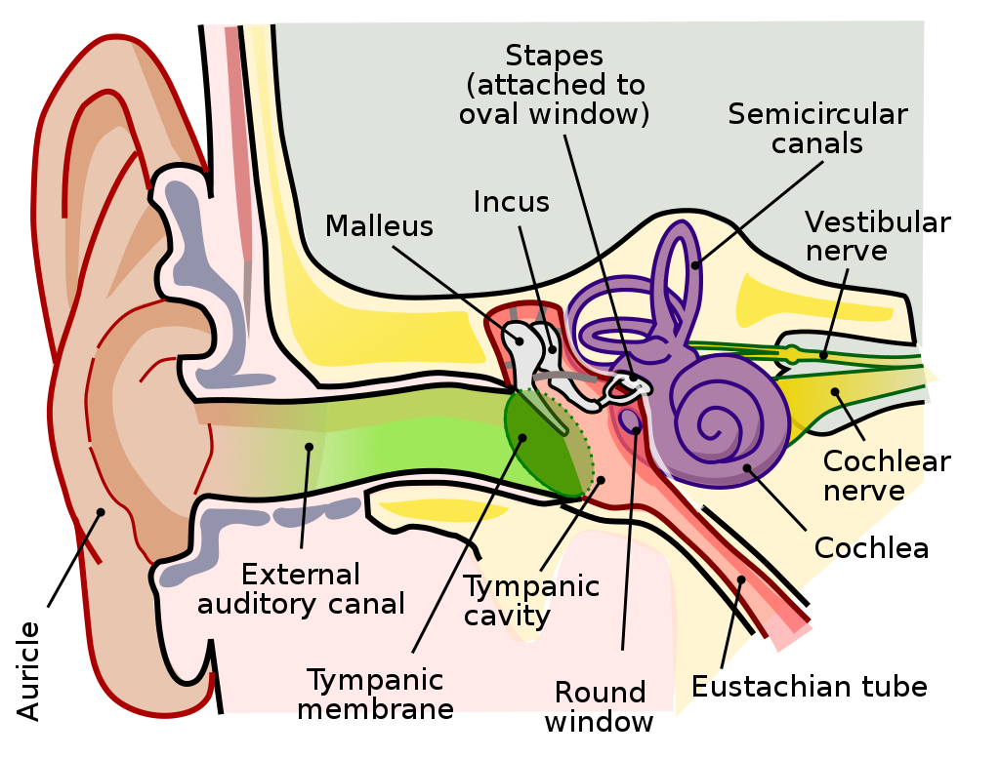

* Draft: 2020-06-14 (Sun)
# Ear or Auditory System
## Structure
### Anatomy of the Human Ear

Source: https://en.wikipedia.org/wiki/File:Anatomy_of_the_Human_Ear.svg

* Brown is outer ear. Red is middle ear. Purple is inner ear.
* Synonyms
  * auricle = auricula = pinna
    * pinna means wing/fin in Latin and is used more in zoology.
  * auditory canal = ear canal
  * Tympanic membrane = eardrum = myringa
  * Tympanic cavity = middle ear cavity
### Outer ear: auricle + auditory canal
* The auricle, the visible part of the ear, collects sound, amplifies/reduces it at certain frequency and directs it into the auditory canal.
  * Due to its anatomy, the pinna creates a band-stop/notch filtering effect.
    * Low frequency sounds are directed toward the ear canal where the pinna behaves similar to a reflector dish.
    * High frequency sounds reflect off the contours of the pinna first and enter the auditory canal after a slight delay.
    * This delay causes phase cancellation eleminating certain frequency component.   
* The auditory canal amplifes sounds between 3 and 12kHz when sound waves enter it.

### Middle ear
* Sound waves travel through the auditory canal and hit the tympanic membrane or eardrum.
* The tympanic membrane amplifies the vibrations of the sound waves.
  * The tympanic cavity (air-filled hole) and a series of delicate bones convert the lower-pressure vibrations into higher-pressure ones.

### Inner ear
* Chchlea transfers pressure waves into nerve impulses.
* Chchlea means `snail shell or spiral` in Ancient Greek.

## References/Sources
* [Auditory system](https://en.wikipedia.org/wiki/Auditory_system), Wikipedia
* [Auricle (anatomy)](https://en.wikipedia.org/wiki/Auricle_(anatomy)), Wikipedia
* [Eardrum](https://en.wikipedia.org/wiki/Eardrum), Wikipedia
* [Cochlea](https://en.wikipedia.org/wiki/Cochlea), Wikipedia
